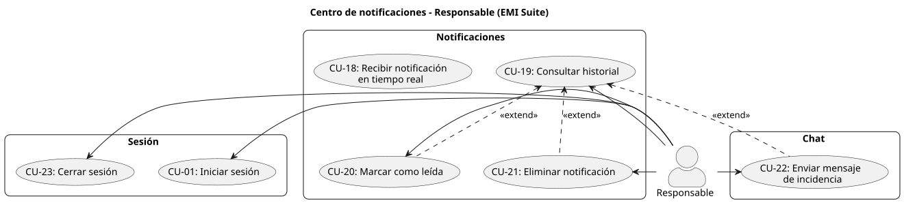
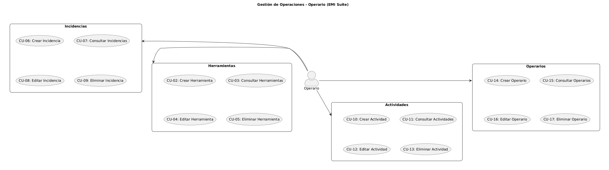
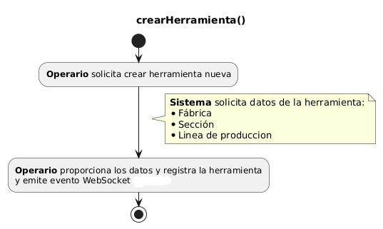
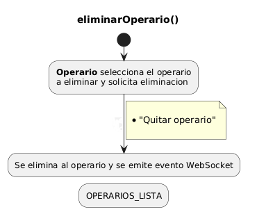
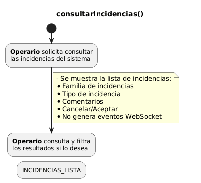
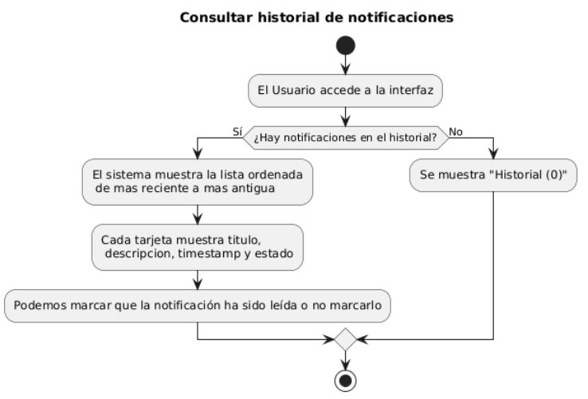

# 3.2 Disciplina de Requisitos

[Volver al capítulo 2](../README.md) | [Volver al índice principal](../../README.md)

---

## 3.2.1 Actores del sistema

| Actor | Descripción |
|---|---|
| Responsable del centro de control | La persona que accede a la aplicación web desde el navegador. Consulta las notificaciones que llegan, las marca como leídas, las borra cuando le parece oportuno y también puede contactar con otros operarios mediante el chat. |
| Operario del servidor de Soincon | La persona que trabaja con EMI Suite 4.0 de Soincon y hace operaciones sobre los documentos del sistema (crear o modificar registros). No interactúa directamente con la aplicación de este TFG, pero sus acciones son el origen de los eventos que provocan las notificaciones que recibe el responsable. |

---

## 3.2.2 Encontrar casos de uso

### Casos de uso

| ID | Nombre | Actor principal| Descripción breve |
|----|--------|-------|-------------------|
| CU-01 | Iniciar sesión | Responsable | El Responsable introduce credenciales para acceder al sistema. |
| CU-02 | Crear Herramienta | Operario | El Operario registra una nueva herramienta en el sistema. Genera notificación. |
| CU-03 | Consultar Herramientas | Operario | El Operario consulta la lista de herramientas registradas. |
| CU-04 | Editar Herramienta | Operario | El Operario modifica los datos de una herramienta existente. Genera notificación. |
| CU-05 | Eliminar Herramienta | Operario | El Operario elimina una herramienta del sistema. Genera notificación. |
| CU-06 | Crear Incidencia | Operario | El Operario registra una nueva incidencia en la planta. Genera notificación. |
| CU-07 | Consultar Incidencias | Operario | El Operario consulta la lista de incidencias registradas. |
| CU-08 | Editar Incidencia | Operario | El Operario actualiza el estado o los datos de una incidencia. Genera notificación. |
| CU-09 | Eliminar Incidencia | Operario | El Operario elimina una incidencia resuelta. Genera notificación. |
| CU-10 | Crear Actividad | Operario | El Operario registra una nueva actividad en la planta. Genera notificación. |
| CU-11 | Consultar Actividades | Operario | El Operario consulta la lista de actividades registradas. |
| CU-12 | Editar Actividad | Operario | El Operario modifica los datos de una actividad existente. Genera notificación. |
| CU-13 | Eliminar Actividad | Operario | El Operario elimina una actividad completada. Genera notificación. |
| CU-14 | Crear Operario | Operario | El Operario registra un nuevo operario en el sistema. Genera notificación. |
| CU-15 | Consultar Operarios | Operario | El Operario consulta la lista de operarios registrados. |
| CU-16 | Editar Operario | Operario | El Operario modifica los datos de un operario existente. Genera notificación. |
| CU-17 | Eliminar Operario | Operario | El Operario elimina un operario del sistema. Genera notificación. |
| CU-18 | Recibir notificación en tiempo real | Responsable | El sistema muestra automáticamente al Responsable una notificación cuando el Operario realiza una operación de escritura. |
| CU-19 | Consultar historial de notificaciones | Responsable | El Responsable visualiza todas las notificaciones recibidas en la sesión activa. |
| CU-20 | Marcar notificación como leída | Responsable | El Responsable indica que ya ha procesado una notificación concreta. |
| CU-21 | Eliminar notificación | Responsable | El Responsable elimina una notificación del historial. |
| CU-22 | Enviar mensaje de incidencia | Responsable | El Responsable envía un mensaje a un operario, pudiendo adjuntar una notificación del historial. |
| CU-23 | Cerrar sesión | Responsable | El Responsable cierra su sesión activa en la aplicación. |

### Casos de uso del actor Responsable

### Casos de uso del actor Operario

---

## 3.2.3 Priorizar casos de uso

| ID | Nombre | Prioridad | Justificación |
|----|--------|-----------|----------------|
| CU-01 | Iniciar sesión | **Alta** | Puerta de entrada al sistema. Sin autenticación no es posible acceder a nada. |
| CU-06 | Crear Incidencia | **Alta** | Es la operación más crítica y frecuente. Las incidencias son el principal motivo de notificación y de uso del chat. |
| CU-18 | Recibir notificación en tiempo real | **Alta** | Caso de uso central del proyecto. El sistema existe para este propósito. |
| CU-19 | Consultar historial de notificaciones | **Alta** | El Responsable necesita ver las notificaciones para que el sistema tenga utilidad. |
| CU-07 | Consultar Incidencias | **Alta** | Necesario para que el Operario pueda gestionar el estado de las incidencias activas. |
| CU-08 | Editar Incidencia | **Alta** | Permite actualizar el estado de una incidencia, lo que genera notificación inmediata al Responsable. |
| CU-02 | Crear Herramienta | **Media** | Necesario para el control de recursos, pero de menor urgencia que las incidencias. |
| CU-04 | Editar Herramienta | **Media** | Permite actualizar el estado de una herramienta. |
| CU-05 | Eliminar Herramienta | **Media** | Permite limpiar recursos obsoletos. |
| CU-03 | Consultar Herramientas | **Media** | Necesario para la gestión básica de herramientas. |
| CU-09 | Eliminar Incidencia | **Media** | Permite cerrar incidencias resueltas. |
| CU-10 | Crear Actividad | **Media** | Necesario para la planificación operativa de la planta. |
| CU-11 | Consultar Actividades | **Media** | Necesario para el seguimiento de actividades en curso. |
| CU-12 | Editar Actividad | **Media** | Permite actualizar el estado o asignación de una actividad. |
| CU-13 | Eliminar Actividad | **Media** | Permite cerrar actividades completadas. |
| CU-14 | Crear Operario | **Media** | Necesario para dar de alta nuevas personas en el sistema. |
| CU-15 | Consultar Operarios | **Media** | Necesario para la gestión del equipo de planta. |
| CU-16 | Editar Operario | **Media** | Permite actualizar datos de un operario existente. |
| CU-20 | Marcar notificación como leída | **Media** | Mejora la usabilidad del historial pero no es crítico para el flujo principal. |
| CU-21 | Eliminar notificación | **Media** | Permite gestionar el historial pero no afecta al flujo principal. |
| CU-22 | Enviar mensaje de incidencia | **Media** | Añade valor comunicativo pero el sistema de notificaciones funciona sin él. |
| CU-17 | Eliminar Operario | **Baja** | Operación poco frecuente y con mayor riesgo de impacto en datos asociados. |
| CU-23 | Cerrar sesión | **Baja** | Importante para la seguridad pero no afecta al flujo principal de uso. |
---

## 3.2.4 Detallar casos de uso

### CU-02: Crear herramienta

| Campo | Descripción |
|-------|-------------|
| **Identificador** | CU-02 |
| **Nombre** | Crear Herramienta |
| **Actor principal** | Operario |
| **Actor secundario** | Responsable (recibe la notificación resultante) |
| **Descripción** | El Operario registra una nueva herramienta en EMI Suite 4.0. El sistema almacena los datos y emite automáticamente un evento WebSocket que el Responsable recibe como notificación. |
| **Precondiciones** | El Operario tiene acceso a EMI Suite. Al menos un Responsable tiene la conexión WebSocket activa. |
| **Flujo principal** | 1. El Operario accede al módulo de herramientas. 2. Selecciona la opción de nueva herramienta. 3. Rellena los datos: nombre, tipo, estado y ubicación. 4. Confirma el registro. 5. El sistema almacena la herramienta y emite un evento WebSocket (CU-18). |
| **Flujo alternativo A** | Si algún campo obligatorio está vacío, el sistema muestra un aviso y no permite confirmar hasta completarlo. |
| **Flujo alternativo B** | Si no hay ningún Responsable conectado, el evento se emite igualmente pero no es recibido. No se produce error. |
| **Postcondiciones** | La herramienta queda registrada en el sistema. El Responsable ha recibido la notificación correspondiente. |

---

### CU-17: Eliminar Operario

| Campo | Descripción |
|-------|-------------|
| **Identificador** | CU-17 |
| **Nombre** | Eliminar Operario |
| **Actor principal** | Operario |
| **Actor secundario** | Responsable (recibe la notificación resultante) |
| **Descripción** | El Operario elimina un operario del sistema cuando ya no forma parte del equipo. El sistema elimina el registro y emite un evento WebSocket. |
| **Precondiciones** | Existe al menos un operario registrado. El Operario tiene permisos de administración. |
| **Flujo principal** | 1. El Operario selecciona el operario a eliminar. 2. El sistema verifica si tiene actividades o incidencias activas asignadas. 3. El sistema solicita confirmación. 4. El Operario confirma. 5. El sistema elimina el registro y emite un evento WebSocket (CU-18). |
| **Flujo alternativo A** | Si el Operario cancela, el sistema no realiza ninguna acción. |
| **Postcondiciones** | El operario ha sido eliminado. El Responsable ha recibido la notificación. |

---

### CU-07: Consultar Incidencias

| Campo | Descripción |
|-------|-------------|
| **Identificador** | CU-07 |
| **Nombre** | Consultar Incidencias |
| **Actor principal** | Operario |
| **Descripción** | El Operario visualiza la lista de incidencias registradas, pudiendo filtrar por tipo, gravedad, estado o fecha. Esta operación no genera notificaciones. |
| **Precondiciones** | El Operario tiene acceso a EMI Suite. |
| **Flujo principal** | 1. El Operario accede al módulo de incidencias. 2. El sistema muestra la lista con descripción, gravedad y estado. 3. El Operario puede filtrar o buscar por cualquier campo. |
| **Flujo alternativo A** | Si no hay incidencias registradas, el sistema muestra un mensaje informativo. |
| **Postcondiciones** | El Operario puede ver el listado actualizado de incidencias. No se generan notificaciones. |

---

### CU-19: Consultar historial de notificaciones

| Campo | Descripción |
|---|---|
| Identificador | CU-19 |
| Nombre | Consultar historial de notificaciones |
| Actor principal | Responsable |
| Descripción | El usuario visualiza la lista de todas las notificaciones recibidas durante la sesión activa, ordenadas de más reciente a más antigua. |
| Precondiciones | La aplicación está cargada en el navegador. Puede haber cero o más notificaciones en el historial. |
| Flujo principal | 1. El responsable accede a la interfaz de la aplicación.  2. El sistema muestra la lista de notificaciones almacenadas en el historial.  3. Cada notificación muestra su título, descripción, marca de tiempo y estado (leída/no leída).  4. Las notificaciones no leídas se distinguen visualmente de las ya leídas. |
| Flujo alternativo A | Si el historial está vacío, el sistema muestra un mensaje informativo indicando que no hay notificaciones. |
| Postcondiciones | El usuario puede ver el estado actual de todas sus notificaciones. |

---

## 3.2.5 Prototipar casos de uso

| CU | Caso de uso | Elemento de interfaz | Descripción visual |
|----|-------------|----------------------|--------------------|
| CU-01 | Iniciar sesión | Pantalla de login | Campo de usuario, campo de contraseña, botón "Entrar". Mensaje de error en rojo si las credenciales son incorrectas. |
| CU-02 | Crear Herramienta | Formulario de nueva herramienta | Modal con campos: nombre, tipo, estado y ubicación. Botones "Cancelar" y "Guardar". |
| CU-03 | Consultar Herramientas | Listado de herramientas | Tabla con columnas: nombre, tipo, estado, ubicación. Buscador y filtros en la parte superior. Botones de editar y eliminar en cada fila. |
| CU-04 | Editar Herramienta | Formulario de edición | Modal con los mismos campos que el de creación, prellenados con los datos actuales. Botones "Cancelar" y "Guardar cambios". |
| CU-05 | Eliminar Herramienta | Diálogo de confirmación | Modal con el texto "¿Eliminar esta herramienta?" y botones "Cancelar" y "Eliminar". |
| CU-06 | Crear Incidencia | Formulario de nueva incidencia | Modal con campos: descripción, tipo, gravedad (selector: baja/media/alta) y elemento afectado. Las incidencias de gravedad alta se muestran con borde rojo. |
| CU-07 | Consultar Incidencias | Listado de incidencias | Tabla con columnas: descripción, tipo, gravedad, estado y fecha. Filtros por gravedad y estado. Indicador visual de color según gravedad. |
| CU-08 | Editar Incidencia | Formulario de edición | Modal con campos prellenados. Incluye selector de estado (abierta/en progreso/resuelta). Botones "Cancelar" y "Guardar cambios". |
| CU-09 | Eliminar Incidencia | Diálogo de confirmación | Modal con el texto "¿Eliminar esta incidencia?" y botones "Cancelar" y "Eliminar". Si tiene actividades activas asociadas, el modal muestra un aviso adicional. |
| CU-10 | Crear Actividad | Formulario de nueva actividad | Modal con campos: descripción, operario asignado (selector), fecha y herramientas necesarias. Botones "Cancelar" y "Guardar". |
| CU-11 | Consultar Actividades | Listado de actividades | Tabla con columnas: descripción, operario asignado, fecha y estado. Filtros por estado y fecha. |
| CU-12 | Editar Actividad | Formulario de edición | Modal con campos prellenados. Incluye selector de estado (pendiente/en progreso/completada). Botones "Cancelar" y "Guardar cambios". |
| CU-13 | Eliminar Actividad | Diálogo de confirmación | Modal con el texto "¿Eliminar esta actividad?" y botones "Cancelar" y "Eliminar". |
| CU-14 | Crear Operario | Formulario de nuevo operario | Modal con campos: nombre, rol (selector) y datos de contacto. Botones "Cancelar" y "Guardar". |
| CU-15 | Consultar Operarios | Listado de operarios | Tabla con columnas: nombre, rol y estado. Buscador por nombre o rol. |
| CU-16 | Editar Operario | Formulario de edición | Modal con campos prellenados. Botones "Cancelar" y "Guardar cambios". |
| CU-17 | Eliminar Operario | Diálogo de confirmación | Modal con el texto "¿Eliminar este operario?" y botones "Cancelar" y "Eliminar". Si tiene elementos activos asignados, muestra un aviso adicional con el detalle. |
| CU-18 | Recibir notificación | Toast emergente | Aparece en la esquina superior derecha. Muestra título, descripción y timestamp. Color según tipo: azul (info), naranja (advertencia), verde (éxito). |
| CU-19 | Consultar historial | Panel de historial | Lista vertical de más reciente a más antigua. Cada tarjeta muestra título, descripción, tipo, timestamp y estado leída/no leída. |
| CU-19 vacío | Historial vacío | Mensaje de estado | Icono y texto "No tienes notificaciones" centrado en el panel. |
| CU-20 | Marcar como leída | Botón de check | Visible en cada tarjeta. Al pulsarlo la tarjeta cambia a apariencia atenuada. |
| CU-21 | Eliminar notificación | Botón de papelera o X | Visible en cada tarjeta. Al pulsarlo desaparece con animación de salida. |
| CU-22 | Enviar mensaje | Ventana de chat | Modal con nombre del contacto en la cabecera, historial de mensajes en el centro y campo de texto con botón de envío abajo. Mensajes del Responsable a la derecha, del contacto a la izquierda. Opción de adjuntar notificación bajo el campo de texto. |
| CU-23 | Cerrar sesión | Diálogo de confirmación | Modal con el texto "¿Cerrar sesión?" y botones "Cancelar" y "Cerrar sesión". |
| General | Estado de conexión | Indicador permanente | Punto de color siempre visible en la barra superior: verde = conectado, naranja = conectando, rojo = desconectado. |

---

## 3.2.6 Estructurar casos de uso

| ID | Nombre | Actor | Incluye | Extiende a |
|----|--------|-------|---------|-------------|
| CU-01 | Iniciar sesión | Responsable | — | — |
| CU-02 | Crear Herramienta | Operario | CU-18 | — |
| CU-03 | Consultar Herramientas | Operario | — | — |
| CU-04 | Editar Herramienta | Operario | CU-18 | — |
| CU-05 | Eliminar Herramienta | Operario | CU-18 | — |
| CU-06 | Crear Incidencia | Operario | CU-18 | — |
| CU-07 | Consultar Incidencias | Operario | — | — |
| CU-08 | Editar Incidencia | Operario | CU-18 | — |
| CU-09 | Eliminar Incidencia | Operario | CU-18 | — |
| CU-10 | Crear Actividad | Operario | CU-18 | — |
| CU-11 | Consultar Actividades | Operario | — | — |
| CU-12 | Editar Actividad | Operario | CU-18 | — |
| CU-13 | Eliminar Actividad | Operario | CU-18 | — |
| CU-14 | Crear Operario | Operario | CU-18 | — |
| CU-15 | Consultar Operarios | Operario | — | — |
| CU-16 | Editar Operario | Operario | CU-18 | — |
| CU-17 | Eliminar Operario | Operario | CU-18 | — |
| CU-18 | Recibir notificación en tiempo real | Responsable | — | — |
| CU-19 | Consultar historial de notificaciones | Responsable | — | — |
| CU-20 | Marcar notificación como leída | Responsable | — | CU-19 |
| CU-21 | Eliminar notificación | Responsable | — | CU-19 |
| CU-22 | Enviar mensaje de incidencia | Responsable | CU-19 (opcional) | — |
| CU-23 | Cerrar sesión | Responsable | — | — |

[Anterior: 3.1 Modelo del Dominio](../3.1_Modelo_del_Dominio/README.md) | [Siguiente: 3.3 Requisitos No Funcionales](../3.3_Requisitos_No_Funcionales/README.md)
