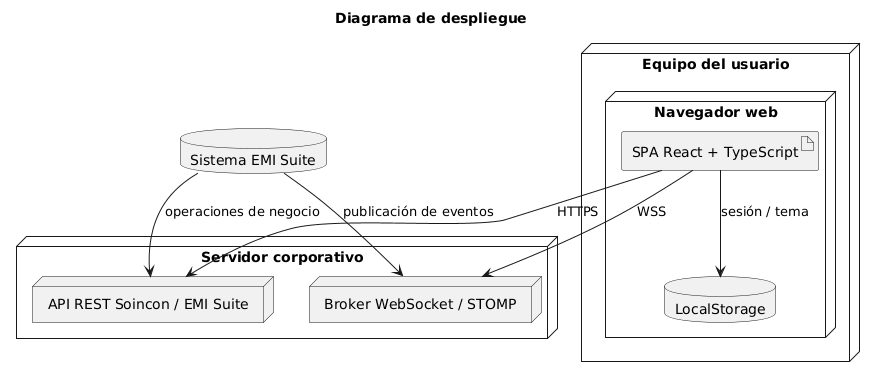

# 4.5 Diseño de la Arquitectura

[Volver al capítulo 3](../README.md) | [Volver al índice principal](../../README.md)

---

[Código fuente](../../codigoFuente/arquitectura.puml)

En la fase de diseño, la arquitectura que teníamos antes se concreta con las tecnologías que finalmente hemos elegido. El cliente se implementa como una SPA desarrollada con **React**, **TypeScript** y **Vite**. El sistema de eventos en tiempo real se implementa con WebSocket nativo del navegador, apoyado en STOMP a través de la librería `@stomp/stompjs`. La gestión del estado de la interacción se reparte entre hooks personalizados, contextos de React y componentes funcionales. Para la demostración y para poder acceder desde dispositivos móviles en la red local, usamos Node.js en scripts auxiliares de arranque.

---

## Separación de canales

La arquitectura de diseño mantiene separados el canal síncrono y el canal asíncrono:

- El **canal REST** se reserva para operaciones de autenticación y para futuras integraciones con la API de Soincon.
- El **canal WebSocket** se dedica solo a recibir eventos desde el broker remoto.
- El **navegador** también actúa como contenedor de estado local, guardando la sesión y las preferencias visuales.

React aporta modularidad y reutilización; los WebSockets ofrecen inmediatez; y la separación en servicios, hooks, contextos y componentes hace que sea más fácil ampliar el sistema en el futuro.

---

[Anterior: 4.4 Análisis de Paquetes](../4.4_Analisis_Paquetes/README.md) | [Siguiente: 4.6 Diseño de Casos de Uso](../4.6_Diseño_Casos_de_Uso/README.md)
