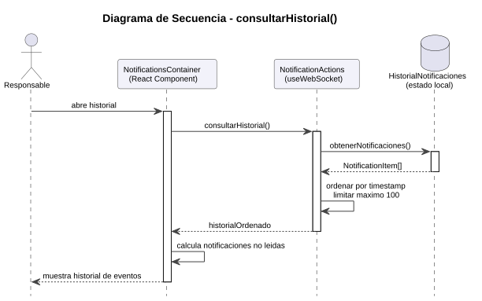
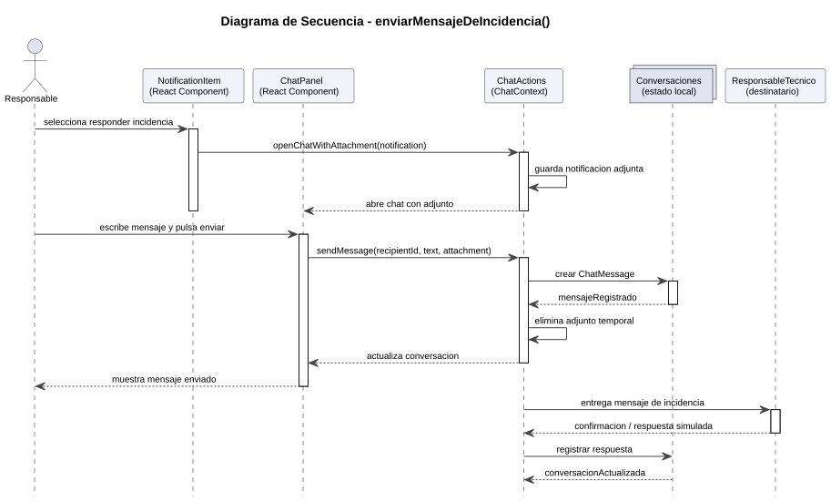

# 4.6 Diseño de Casos de Uso

[Volver al capítulo 3](../README.md) | [Volver al índice principal](../../README.md)

---

# Diagramas de secuencia

[Código fuente](../../codigoFuente/secuenciaHistorial.puml)

## consultarHistorial()

El diagrama muestra como el responsable abre el historial desde el contenedor de notificaciones. La vista solicita a la logica de notificaciones el listado almacenado, que se obtiene desde el estado local `HistorialNotificaciones`. Despues, la logica ordena los eventos, aplica el limite maximo de notificaciones y devuelve el resultado a la vista para mostrar el historial al responsable.

## enviarMensajeDeIncidencia()

[Código fuente](../../codigoFuente/secuenciaIncidencia.puml)

El diagrama representa el envio de un mensaje de incidencia a partir de una notificacion. El responsable selecciona la opcion de responder desde una notificacion, la logica del chat guarda esa notificacion como adjunta y abre el panel de chat. Cuando el responsable escribe y envia el mensaje, se crea un `ChatMessage`, se registra en las conversaciones locales y se entrega al destinatario tecnico, que puede devolver una confirmacion o respuesta simulada.

---

[Anterior: 4.5 Diseño de la Arquitectura](../4.5_Diseño_Arquitectura/README.md) | [Siguiente: 4.7 Diseño de Clases](../4.7_Diseño_Clases/README.md)
