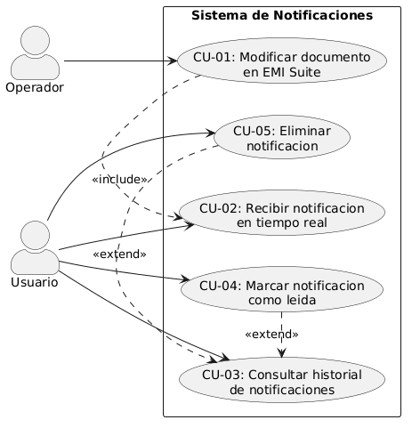
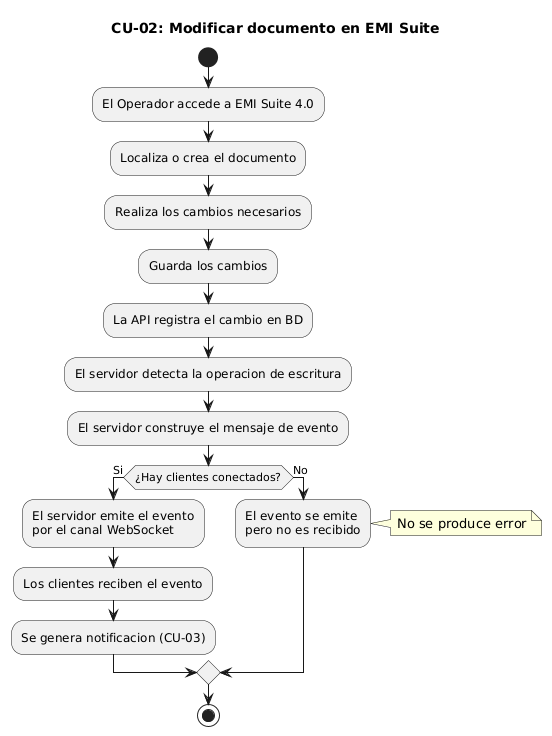
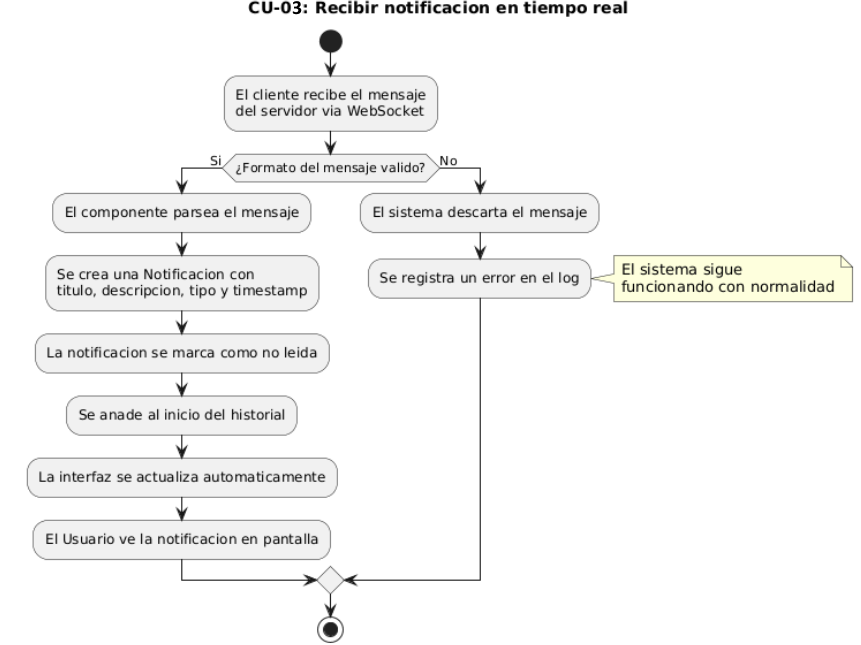
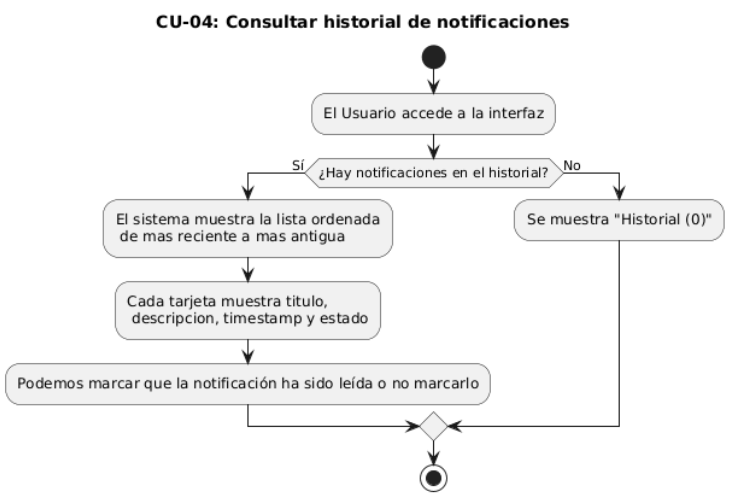
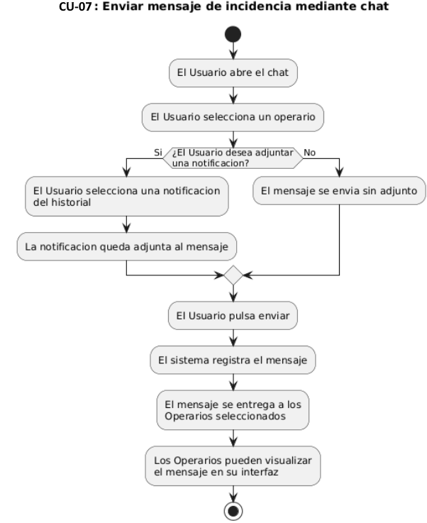

# 3.2 Disciplina de Requisitos

[Volver al capítulo 3](../README.md) | [Volver al índice principal](../../README.md)

---

La disciplina de requisitos es el proceso en el que identificamos y describimos de forma clara lo que tiene que hacer el sistema. En este proyecto hemos seguido el enfoque de casos de uso, que es una técnica estándar en ingeniería del software para describir el sistema desde el punto de vista de quienes interactúan con él.

---

## 3.2.1 Actores del sistema

| Actor | Descripción |
|---|---|
| Responsable del centro de control | La persona que accede a la aplicación web desde el navegador. Consulta las notificaciones que llegan, las marca como leídas, las borra cuando le parece oportuno y también puede contactar con otros operarios mediante el chat. |
| Operario del servidor de Soincon | La persona que trabaja con EMI Suite 4.0 de Soincon y hace operaciones sobre los documentos del sistema (crear o modificar registros). No interactúa directamente con la aplicación de este TFG, pero sus acciones son el origen de los eventos que provocan las notificaciones que recibe el responsable. |

---

## 3.2.2 Encontrar casos de uso

| ID | Nombre | Actor principal | Descripción |
|---|---|---|---|
| CU-01 | Iniciar sesión | Responsable | El administrador mete sus credenciales para entrar al sistema. Solo los usuarios con rol de administrador pueden acceder. |
| CU-02 | Modificar documento o evento en EMI Suite | Operador | El operador crea o modifica un documento/evento en EMI Suite, y eso hace que automáticamente se emita un evento WebSocket hacia los usuarios que estén conectados. |
| CU-03 | Recibir notificación en tiempo real | Responsable | El sistema recibe el evento que ha lanzado el servidor y lo muestra como notificación al usuario de forma automática, sin que él tenga que hacer nada. |
| CU-04 | Consultar historial de notificaciones | Responsable | El responsable puede ver la lista de todas las notificaciones que han llegado durante la sesión activa. |
| CU-05 | Marcar notificación como leída | Responsable | El responsable indica que ya ha visto y procesado una notificación concreta. |
| CU-06 | Eliminar notificación | Responsable | El responsable borra una notificación concreta del historial. |
| CU-07 | Enviar mensaje de incidencia | Responsable | El responsable envía un mensaje a uno o varios operarios para avisarles de una incidencia, y puede adjuntar una notificación recibida para dar contexto. |
| CU-08 | Cerrar sesión | Responsable | Cuando termina el trabajo, el responsable cierra su sesión en la aplicación. |

---

## 3.2.3 Priorizar casos de uso

| ID | Nombre | Prioridad | Justificación |
|---|---|---|---|
| CU-01 | Iniciar sesión | Alta | Sin autenticación no hay acceso al sistema. |
| CU-02 | Modificar documento en EMI Suite | Alta | Si el operador no genera cambios en los datos, no hay eventos y por tanto no hay notificaciones. Es el punto de partida de todo el flujo. |
| CU-03 | Recibir notificación en tiempo real | Alta | Es el caso de uso central del proyecto. El sistema existe para esto. |
| CU-04 | Consultar historial de notificaciones | Alta | El responsable necesita poder ver las notificaciones que han llegado para que el sistema sea útil. |
| CU-05 | Marcar notificación como leída | Media | Mejora la usabilidad, pero no es imprescindible para el funcionamiento básico. |
| CU-06 | Eliminar notificación | Media | Permite al responsable gestionar su historial, pero no afecta al flujo principal. |
| CU-07 | Enviar mensaje de incidencia mediante chat | Media | Mejora la gestión de incidencias porque permite la comunicación directa entre usuarios y operarios, pero el sistema de notificaciones en tiempo real funciona igual sin este chat. |
| CU-08 | Cerrar sesión | Media | Permite al usuario cerrar la sesión. Al cerrarla, se renuevan las notificaciones y el contador se pone a 0. |

---

## 3.2.4 Detallar casos de uso

### CU-01: Iniciar sesión

| Campo | Descripción |
|---|---|
| Identificador | CU-01 |
| Nombre | Iniciar sesión |
| Actor principal | Responsable |
| Descripción | El administrador introduce sus credenciales (usuario y contraseña) para acceder a la aplicación. El sistema solo deja pasar a los usuarios con rol de administrador. |
| Precondiciones | La aplicación está disponible y se puede acceder desde el navegador. El usuario tiene credenciales de administrador válidas. |
| Flujo principal | 1. El usuario va a la página de inicio de sesión. 2. El usuario escribe su nombre de usuario y contraseña. 3. El sistema comprueba que las credenciales son de un administrador. 4. El sistema inicia la sesión y redirige al administrador al panel principal. |
| Flujo alternativo | Si las credenciales son incorrectas o el usuario no tiene permisos, el sistema muestra el mensaje "Acceso restringido al personal autorizado". |
| Postcondiciones | El administrador tiene acceso al sistema y puede usar todas sus funciones. |

---

### CU-02: Modificar documento en EMI Suite

| Campo | Descripción |
|---|---|
| Identificador | CU-02 |
| Nombre | Modificar documento en EMI Suite |
| Actor principal | Operador |
| Actor secundario | Responsable (a él le llega la notificación) |
| Descripción | El operador crea o modifica un documento en EMI Suite 4.0. Esta acción hace que el servidor emita automáticamente un evento WebSocket hacia todos los clientes que estén conectados en ese momento. |
| Precondiciones | El operador tiene acceso a EMI Suite 4.0. Al menos un cliente tiene la conexión WebSocket activa. |
| Flujo principal | 1. El operador entra en EMI Suite 4.0 y busca o crea el documento. 2. Hace los cambios que necesita y los guarda. 3. La API de Soincon registra el cambio en la base de datos. 4. El servidor detecta la operación de escritura y construye un mensaje de evento. 5. El servidor lanza el evento por el canal WebSocket a todos los clientes conectados. 6. Los clientes reciben el evento y procesan la notificación (CU-03). |
| Flujo alternativo A | Si en el momento de la modificación no hay ningún cliente conectado por WebSocket, el evento se emite igual pero no lo recibe nadie. No ocurre ningún error. |
| Postcondiciones | El documento se ha creado o modificado en EMI Suite 4.0. Se ha emitido un evento WebSocket. Los clientes que estaban conectados han recibido la notificación correspondiente. |

---

### CU-03: Recibir notificaciones en tiempo real

| Campo | Descripción |
|---|---|
| Identificador | CU-03 |
| Nombre | Recibir notificación en tiempo real |
| Actor principal | Responsable |
| Descripción | El servidor de Soincon emite un evento por el canal WebSocket cuando se produce un cambio en los datos de EMI Suite 4.0. El cliente recibe ese evento y lo convierte en una notificación visual que se muestra al usuario de forma automática. |
| Precondiciones | La conexión WebSocket entre el cliente y el servidor está activa. |
| Flujo principal | 1. El servidor detecta un cambio en los datos. 2. El servidor construye un mensaje de evento con el tipo de cambio, el identificador del documento afectado y una descripción. 3. El servidor emite el evento por el canal WebSocket. 4. El cliente recibe el mensaje a través de la conexión WebSocket activa. 5. El componente de notificaciones procesa el mensaje y crea una nueva notificación con título, descripción, tipo y marca de tiempo. 6. La notificación se añade al principio del historial. 7. La interfaz se actualiza automáticamente y le muestra la nueva notificación al usuario. |
| Flujo alternativo A | Si el mensaje recibido tiene un formato inválido o está incompleto, el sistema descarta el evento y registra un error en el log sin que el resto del sistema deje de funcionar. |
| Postcondiciones | El historial de notificaciones tiene una nueva entrada. La notificación está marcada como no leída. El usuario puede verla en la interfaz. |

---

### CU-04: Consultar historial de notificaciones

| Campo | Descripción |
|---|---|
| Identificador | CU-04 |
| Nombre | Consultar historial de notificaciones |
| Actor principal | Responsable |
| Descripción | El usuario ve la lista de todas las notificaciones que ha recibido durante la sesión activa, ordenadas de la más reciente a la más antigua. |
| Precondiciones | La aplicación está cargada en el navegador. Puede haber cero o más notificaciones en el historial. |
| Flujo principal | 1. El responsable accede a la interfaz de la aplicación. 2. El sistema muestra la lista de notificaciones guardadas en el historial. 3. Cada notificación muestra su título, descripción, marca de tiempo y estado (leída/no leída). 4. Las notificaciones no leídas se distinguen visualmente de las que ya están leídas. |
| Flujo alternativo A | Si el historial está vacío, el sistema muestra un mensaje informativo diciendo que no hay notificaciones. |
| Postcondiciones | El usuario puede ver el estado actual de todas sus notificaciones. |

---

### CU-05: Marcar notificación como leída

| Campo | Descripción |
|---|---|
| Identificador | CU-05 |
| Nombre | Marcar notificación como leída |
| Actor principal | Responsable |
| Descripción | El usuario marca una notificación concreta como leída para indicar que ya la ha visto y procesado. Su estado visual cambia en el historial. |
| Precondiciones | Hay al menos una notificación en estado no leído en el historial. |
| Flujo principal | 1. El usuario busca en el historial la notificación que quiere marcar como leída. 2. El usuario pulsa el control correspondiente en esa notificación. 3. El sistema cambia el estado de la notificación a leída. 4. La interfaz refleja el cambio de estado visualmente de forma inmediata. |
| Flujo alternativo A | Si la notificación ya estaba marcada como leída, el sistema no hace nada. |
| Postcondiciones | La notificación queda marcada como leída en el historial. Su apariencia visual refleja el nuevo estado. |

---

### CU-06: Eliminar notificación

| Campo | Descripción |
|---|---|
| Identificador | CU-06 |
| Nombre | Eliminar notificación |
| Actor principal | Responsable |
| Descripción | El usuario borra una notificación concreta del historial cuando ya no la necesita. |
| Precondiciones | Hay al menos una notificación en el historial. |
| Flujo principal | 1. El usuario busca en el historial la notificación que quiere borrar. 2. El usuario pulsa el control de eliminación de esa notificación. 3. El sistema borra la notificación del historial. 4. La interfaz actualiza la lista de notificaciones y muestra el historial sin la notificación borrada. |
| Flujo alternativo A | Si después de borrar la notificación el historial se queda vacío, el sistema muestra el mensaje de historial vacío que se describió en CU-04. |
| Postcondiciones | La notificación ya no aparece en el historial. El cambio es permanente durante la sesión activa. |

---

### CU-07: Enviar mensaje de incidencia mediante chat

| Campo | Descripción |
|---|---|
| Identificador | CU-07 |
| Nombre | Enviar mensaje de incidencia mediante chat |
| Actor principal | Responsable |
| Actor secundario | Operario de Soincon |
| Descripción | El usuario escribe un mensaje de incidencia y lo envía a uno o varios operarios de Soincon a través del chat integrado. Puede adjuntar una notificación que haya recibido para dar contexto sobre el evento que ha ocurrido. |
| Precondiciones | El responsable tiene acceso a la interfaz del chat. Hay al menos un operario de Soincon disponible para recibir el mensaje. Opcionalmente, hay al menos una notificación en el historial para adjuntar al mensaje. |
| Flujo principal | 1. El usuario abre el chat. 2. El usuario selecciona uno o varios operarios como destinatarios. 3. El usuario escribe el mensaje de incidencia. 4. Si quiere, el usuario selecciona una notificación del historial para adjuntarla al mensaje. 5. El usuario envía el mensaje. 6. El sistema registra el mensaje y lo entrega a los operarios seleccionados. 7. Los operarios pueden ver el mensaje en su interfaz correspondiente. |
| Postcondiciones | La incidencia queda registrada y enviada a los operarios seleccionados. |

---

### CU-08: Cerrar sesión

| Campo | Descripción |
|---|---|
| Identificador | CU-08 |
| Nombre | Cerrar sesión |
| Actor principal | Responsable |
| Descripción | El Responsable cierra su sesión activa en la aplicación. El sistema borra la sesión y redirige al usuario a la pantalla de inicio de sesión. |
| Precondiciones | El Responsable tiene una sesión activa iniciada en la aplicación. |
| Flujo principal | 1. El Responsable pulsa el botón de cerrar sesión. 2. El sistema invalida la sesión activa del usuario. 3. El sistema cierra la conexión WebSocket que estaba asociada a esa sesión. 4. El sistema redirige al usuario a la pantalla de inicio de sesión. |
| Flujo alternativo | Si se pierde la conexión con el servidor mientras se cierra la sesión, el sistema borra igualmente los datos de sesión locales y redirige al usuario a la pantalla de inicio de sesión. |
| Postcondiciones | La sesión del Responsable se ha borrado. No se puede acceder a ninguna funcionalidad sin volver a iniciar sesión. La conexión WebSocket se ha cerrado correctamente. |

---

## 3.2.5 Prototipar casos de uso

| Caso de uso | Elemento en la interfaz | Descripción visual |
|---|---|---|
| CU-01 (Iniciar sesión) | Panel de login | Una interfaz sencilla donde el responsable tendrá que iniciar sesión para poder usarla. |
| CU-03 (Recibir notificación en tiempo real) | Tarjeta emergente | Aparece en la esquina inferior derecha cuando llega una notificación nueva. Muestra título, mensaje y marca de tiempo. |
| CU-04 (Consultar historial de notificaciones) | Panel del historial | Lista vertical ordenada de la más reciente a la más antigua. Cada tarjeta muestra título, mensaje, marca de tiempo y estado leída/no leída, con una diferencia visual clara. |
| CU-05 (Marcar notificación como leída) | Botón "leídas" | Visible al entrar en el historial. Al pulsarlo, las notificaciones no leídas pasan a leídas y aparece una tarjeta emergente avisando de ello. |
| CU-06 (Eliminar notificación) | Botón "limpiar" | También visible solo en el historial. Al pulsarlo, se borran todas las notificaciones. |
| CU-07 (Enviar mensaje de incidencia mediante chat) | Ventana/panel de chat | Área de mensajes con lista de conversaciones, un campo de texto para escribir, un selector de destinatarios y una opción para adjuntar una notificación existente como referencia. |
| CU-08 (Cerrar sesión) | Botón | Botón de cerrar sesión que lleva al panel de login. |

Además de los casos de uso, hay un **indicador de conexión**: si el sistema está conectado se ve de color verde; si está conectando o desconectado se ve en gris.

---

## 3.2.6 Estructurar casos de uso

| ID | Nombre | Actor principal | Incluye | Extiende a |
|---|---|---|---|---|
| CU-01 | Iniciar sesión | Responsable | - | - |
| CU-02 | Modificar documento en EMI Suite | Operador | CU-03 | - |
| CU-03 | Recibir notificación en tiempo real | Responsable | - | - |
| CU-04 | Consultar historial de notificaciones | Responsable | - | - |
| CU-05 | Marcar notificación como leída | Responsable | - | CU-04 |
| CU-06 | Eliminar notificación | Responsable | - | CU-04 |
| CU-07 | Enviar mensaje de incidencia | Responsable | CU-04 (si se adjunta notificación) | - |
| CU-08 | Cerrar sesión | Responsable | - | - |

---

[Anterior: 3.1 Modelo del Dominio](../3.1_Modelo_del_Dominio/README.md) | [Siguiente: 3.3 Requisitos No Funcionales](../3.3_Requisitos_No_Funcionales/README.md)
