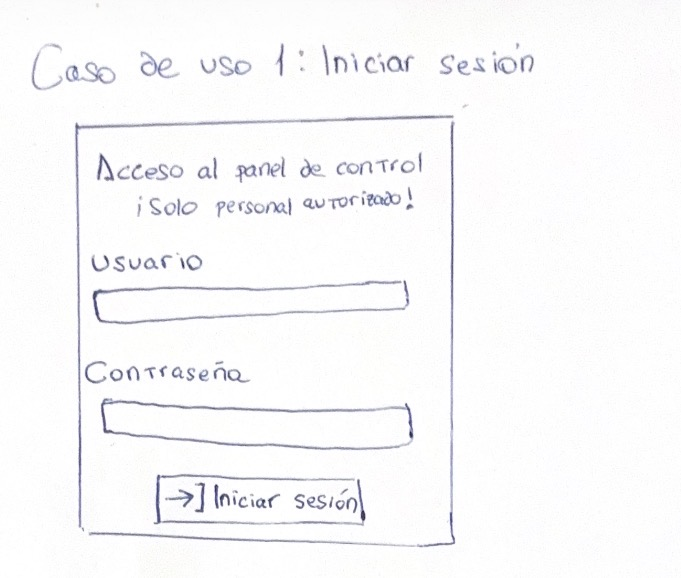
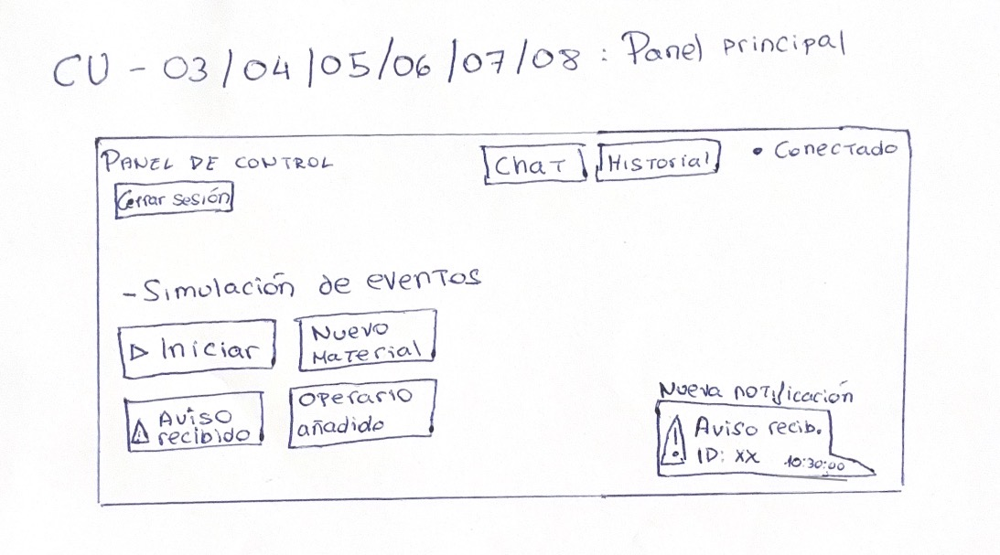
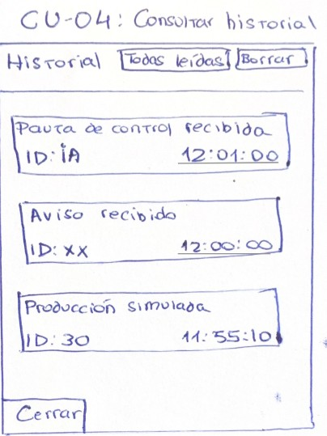
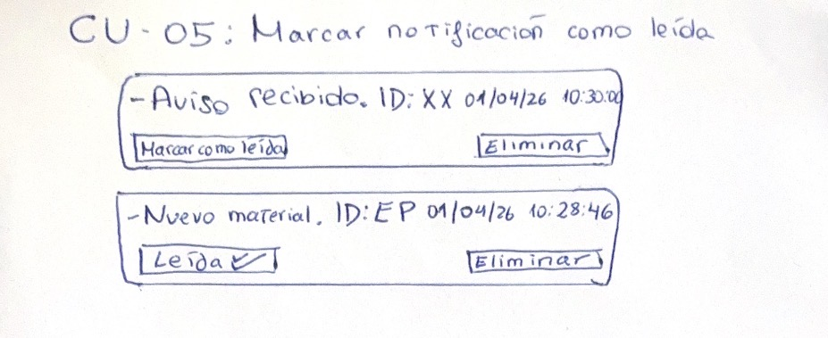
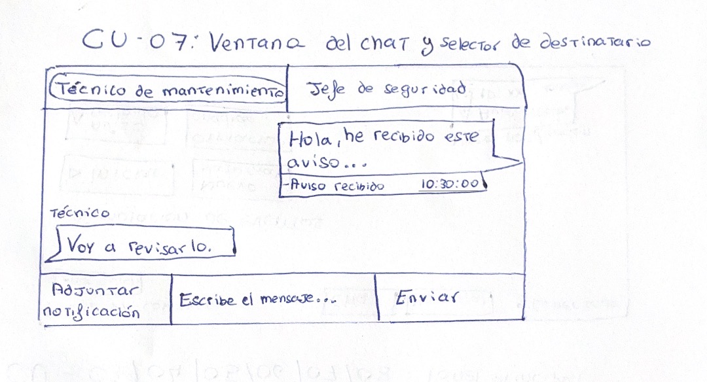

# 3.4 Mockups de la Aplicación

[Volver al capítulo 3](../README.md) | [Volver al índice principal](../../README.md)

---

En este apartado se enseñan los mockups del diseño de la aplicación, uno para cada caso de uso principal o uno el que se puedan agrupar varios casos de uso, como en el panel principal.

---

## MockUp 1 - Pantalla de inicio de sesión (CU-01)

Interfaz sencilla de autenticación. Tiene el título "Acceso al panel de control", una descripción que dice que el acceso solo es para personal autorizado, un campo de usuario, un campo de contraseña y un botón de "Iniciar sesión".

---

## MockUp 2 - Panel principal (CU-03/04/05/06/07/08)

Vista principal de la aplicación después de autenticarse. Contiene:

- Barra superior con el título "Panel de Control", botones de "Chat" e "Historial", un indicador de estado de conexión (verde = conectado) y un botón de "Cerrar Sesión".
- Sección "Simulación de eventos" con botones para lanzar eventos de prueba: "Iniciar Proceso", "Nuevo Material", "Aviso recibido", "Operario añadido".
- Zona de notificaciones emergentes en la esquina inferior derecha, con el formato: tipo de aviso, mensaje corto e ID del documento con la marca de tiempo.

---

## MockUp 3 - Pantalla del historial (CU-04)

Panel lateral o ventana emergente que muestra el historial completo de notificaciones. Contiene:

- Cabecera con el título "Historial", un botón "Todas leídas" y un botón "Borrar".
- Lista de tarjetas de notificación ordenadas por hora, cada una con: título, ID del documento y marca de tiempo.
- Botón "Cerrar" en la parte de abajo.

---

## MockUp 4 - Marcar notificación como leída (CU-05)

Vista de una tarjeta de notificación con dos acciones posibles: "Marcar como leída" (cuando todavía no se ha leído) y "Leída" (cuando ya se ha procesado), junto a un botón "Eliminar" en cada tarjeta.

---

## MockUp 5 - Ventana del chat y selector de destinatario (CU-07)

Panel de chat integrado con:

- Pestañas de conversación por contacto (por ejemplo: "Técnico de mantenimiento", "Jefe de seguridad").
- Zona de mensajes con la conversación activa, incluyendo notificaciones adjuntadas con su tipo, descripción y marca de tiempo.
- Campo de texto para escribir el mensaje.
- Botón "Adjuntar notificación" y botón "Enviar".

---

[Anterior: 3.3 Requisitos No Funcionales](../3.3_Requisitos_No_Funcionales/README.md) | [Siguiente: Capítulo 4 - Análisis y Diseño](../../Capitulo4_Analisis_Diseno/README.md)
