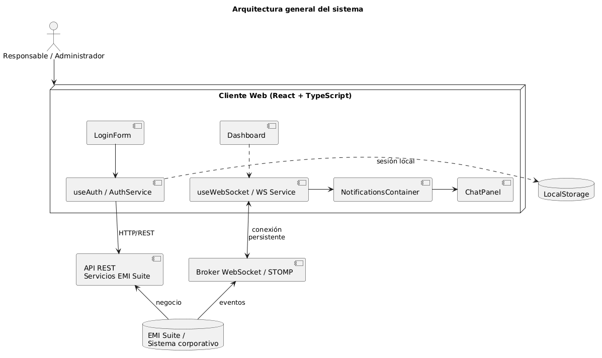

# 4.1 Análisis de la Arquitectura

[Volver al capítulo 4](../README.md) | [Volver al índice principal](../../README.md)

---

La solución planteada sigue una arquitectura cliente-servidor orientada a eventos. En ella, el cliente web actúa como consumidor de información en tiempo real y como punto de interacción del usuario, mientras que el sistema de EMI Suite actúa como generador de cambios de estado y fuente de los datos operativos.

---

## Modelo de doble canal de comunicación

El sistema usa un modelo de doble canal de comunicación:

**Canal síncrono (HTTP/REST):** más apropiado para operaciones de autenticación, consultas puntuales o para recuperar información estructurada.

**Canal asíncrono (WebSocket):** se encarga de transportar en tiempo real los eventos que se generan en el entorno de EMI Suite. Así se consigue que las notificaciones se propaguen al instante.

Esta combinación permite aprovechar las ventajas de los dos enfoques: REST para las operaciones transaccionales y WebSocket para que las notificaciones lleguen enseguida.

En el contexto de este TFG, esta arquitectura funciona muy bien porque el objetivo principal no es solo mostrar información, sino hacerlo al momento y sin que el usuario tenga que hacer nada. Cuando en EMI Suite se produce un cambio importante (una parada, una modificación de material, una actualización de operarios o un aviso de planta), ese cambio tiene que llegar al responsable y verse en la interfaz de forma automática.

Desde el punto de vista de la implementación, el frontend hecho en React concentra la lógica de presentación, la gestión del estado de las notificaciones, el historial, el chat con contexto y el indicador de conexión. La conexión con el broker de eventos se hace mediante WebSocket con STOMP, lo que permite suscribirse a distintos temas y recibir los mensajes de forma estructurada.

---

## Decisiones de arquitectura y justificación

- Se adopta una arquitectura cliente-servidor porque separa claramente la interfaz de usuario de los sistemas que emiten los eventos.
- Se usa WebSocket como mecanismo principal de actualización porque reduce la latencia y evita tener que recargar la página o estar preguntando constantemente (polling).
- Se emplea STOMP sobre WebSocket porque facilita organizar los mensajes por temas y simplifica suscribirse a distintos tipos de eventos.
- Se desarrolla el cliente como una SPA en React para favorecer la modularidad, la reactividad y que los componentes se puedan reutilizar.
- Se centraliza la gestión de la conexión y de las notificaciones en servicios y hooks específicos para que sea más fácil de mantener.
- Se mantiene la idea del canal REST en la arquitectura porque el sistema está pensado para convivir con servicios corporativos tradicionales, aunque en la versión actual esa parte esté parcialmente simulada.

---

[Anterior: Capítulo 4 (intro)](../README.md) | [Siguiente: 4.2 Análisis de Casos de Uso](../4.2_Analisis_Casos_de_Uso/README.md)
