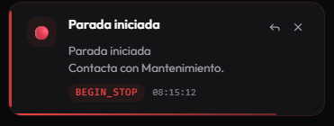

# 4.2 Análisis de Casos de Uso

[Volver al capítulo 4](../README.md) | [Volver al índice principal](../../README.md)

---

## CU-01: Iniciar sesión

Este caso de uso hace que solo el personal autorizado pueda acceder al panel de control. La interfaz de entrada es `LoginForm`, que recoge las credenciales del usuario. La operación la hace `useAuth`, mientras que la validación y que la sesión se mantenga se delegan en `AuthService`. Finalmente, `App` decide qué interfaz se muestra según si el usuario está autenticado o no.

**Clases participantes:** `LoginForm`, `useAuth`, `AuthService`, `App`

**Responsabilidades:**
- `useAuth`: orquestar el proceso y gestionar los estados de carga y error.
- `AuthService`: validar las credenciales y guardar la sesión.
- `App`: permitir o denegar el acceso a la zona principal.
- `LoginForm`: recoger el usuario y la contraseña.

---

## CU-02: Modificar documento en EMI Suite

Aunque la modificación del documento no ocurre dentro de este TFG, este caso de uso es importante a nivel de análisis porque es el origen del evento que lanza la notificación. Desde la perspectiva del sistema que analizamos, EMI Suite actúa como un sistema externo que genera cambios. Una vez modificada la información, el backend o el broker asociado publica el evento correspondiente.

**Clases participantes:** ninguna propia del cliente (ConexionWebSocket, documentos y evento del servidor).

**Responsabilidades:**
- Documento: representar el recurso de negocio que se ha modificado.
- Evento: encapsular el cambio que ha ocurrido.
- ConexionWebSocket: recibir o canalizar la propagación del cambio hacia el cliente.

---

## CU-03: Recibir notificaciones en tiempo real

Es el caso de uso central del sistema. Después de establecer la conexión, el cliente se suscribe a los temas que tiene configurados y procesa cada mensaje que le llega. `WebSocketService` se encarga de la conexión y la suscripción; `useWebSocket` transforma los mensajes en notificaciones que se entienden bien; `NotificationsContainer` y `NotificationItem` las muestran en pantalla.

**Clases participantes:** `WebSocketService`, `useWebSocket`, `NotificationItem`, `NotificationsContainer`

**Responsabilidades:**
- `WebSocketService`: abrir la conexión y escuchar los mensajes.
- `useWebSocket`: normalizar los mensajes y generar notificaciones.
- `NotificationsContainer`: mostrar las notificaciones activas y el historial.
- `NotificationItem`: representar cada aviso de forma individual.

  

---

## CU-04: Consultar historial de notificaciones

Este caso de uso permite al administrador revisar todas las notificaciones que se han acumulado durante la sesión, ordenadas de la más reciente a la más antigua. El control del historial recae en `useWebSocket`, y su representación se concentra en `NotificationsContainer`.

**Clases participantes:** `useWebSocket`, `NotificationsContainer`, `Notificacion`, `HistorialNotificaciones`

**Responsabilidades:**
- `HistorialNotificaciones`: mantener la colección lógica de eventos.
- `useWebSocket`: proporcionar el estado del historial.
- `NotificationsContainer`: mostrar la lista completa de eventos.

---

## CU-05: Marcar notificación como leída

Con esta acción el usuario puede confirmar que ha leído y entendido cada una de las notificaciones que han llegado. La acción se lanza desde la interfaz y se traduce en actualizar el atributo `isRead`.

**Clases participantes:** `NotificationItem`, `NotificationsContainer`, `useWebSocket`

**Responsabilidades:**
- `NotificationItem`: lanzar la acción del usuario.
- `useWebSocket`: actualizar el estado de lectura.
- `NotificationsContainer`: refrescar la vista del historial.

---

## CU-06: Eliminar notificación

Este caso de uso permite borrar una notificación concreta o vaciar el historial entero. La lógica de borrado se centraliza en `useWebSocket`, mientras que la vista expone la acción mediante botones en la interfaz.

**Clases participantes:** `NotificationItem`, `NotificationsContainer`, `useWebSocket`

**Responsabilidades:**
- `NotificationItem`: borrar una notificación individual.
- `NotificationsContainer`: permitir limpiar todo el historial.
- `useWebSocket`: actualizar el estado interno del historial.

---

## CU-07: Enviar mensaje de incidencia mediante chat

Este caso de uso amplía el sistema de notificaciones añadiendo una vía para reaccionar operativamente. A partir de una notificación concreta, el usuario puede abrir el chat y adjuntar el evento como contexto. La coordinación recae en `ChatContext`, mientras que `ChatPanel` gestiona la interacción visual.

**Clases participantes:** `NotificationItem`, `ChatPanel`, `ChatContext`

**Responsabilidades:**
- `NotificationItem`: iniciar la respuesta con contexto.
- `ChatPanel`: escribir y mostrar la conversación.
- `ChatContext`: guardar los mensajes, los adjuntos y los destinatarios.

---

## CU-08: Cerrar sesión

En la página principal (Dashboard) hay un botón para cerrar la sesión. Una vez cerrada, las notificaciones y las conversaciones del chat no se guardan.

---

[Anterior: 4.1 Análisis de la Arquitectura](../4.1_Analisis_Arquitectura/README.md) | [Siguiente: 4.3 Análisis de Clases](../4.3_Analisis_Clases/README.md)
