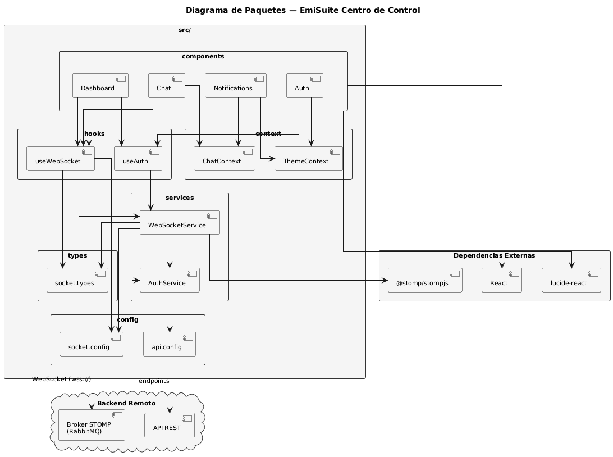
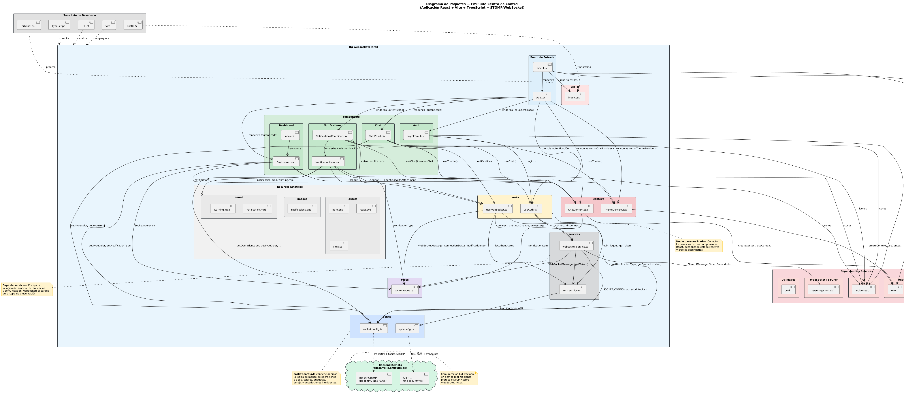

# 4.4 Análisis de Paquetes

[Volver al capítulo 4](../README.md) | [Volver al índice principal](../../README.md)

---

Una vez que tenemos identificadas las clases, las agrupamos en paquetes lógicos. Esta agrupación nos ayuda a separar responsabilidades y hace más fácil que el sistema pueda crecer y cambiar. En el análisis hemos seguido una organización clásica en modelo, vista y controlador.

**Paquete modelo:** contiene las entidades del dominio y la representación lógica de los eventos y las notificaciones.

**Paquete vista:** reúne las interfaces con las que interactúa el usuario.

**Paquete controlador:** conecta los dos anteriores, coordinando los casos de uso que hemos definido.

# Diagrama simple de paquetes.

# Diagrama completo de paquetes.

---

[Anterior: 4.3 Análisis de Clases](../4.3_Analisis_Clases/README.md) | [Siguiente: 4.5 Diseño de la Arquitectura](../4.5_Diseño_Arquitectura/README.md)
