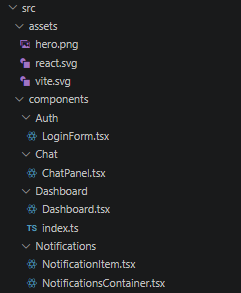
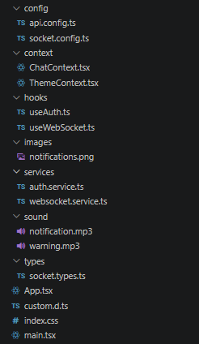

# Capítulo 4 - Descripción de la solución

[Volver al índice principal](../README.md) 

## 4.1 Visión general de la solución

La solución desarrollada en este Trabajo Fin de Grado consiste en una aplicación web de monitorización orientada a un centro de control industrial, cuyo objetivo principal es recibir y mostrar eventos en tiempo real generados en EMI Suite 4.0, evitando los retrasos e ineficiencias propios de los mecanismos tradicionales de consulta periódica. Para ello se ha construido una SPA basada en React, TypeScript y Vite, conectada a un broker remoto mediante WebSockets y STOMP.

El sistema se ha concebido como un cliente ligero, modular y reutilizable. En lugar de replicar toda la lógica de negocio del entorno industrial, la aplicación se centra en la última milla de la comunicación: recibir eventos del servidor, transformarlos en información comprensible para el usuario y ofrecer una interfaz operativa para su seguimiento. Sobre esta base se han incorporado además funcionalidades complementarias, como un historial de notificaciones, una capa mínima de autenticación, cambio de tema visual y un chat contextual para comunicar incidencias a distintos perfiles de operario.

## 4.2 Arquitectura final del sistema

La arquitectura implementada sigue un modelo cliente-servidor con separación clara entre canal síncrono y canal asíncrono. El canal síncrono queda reservado para autenticación e integraciones REST futuras con la API de Soincon, mientras que el canal asíncrono se materializa mediante una conexión WebSocket persistente encargada de transportar los eventos del sistema en tiempo real.

En el lado cliente, la aplicación se organiza en cuatro capas principales:

1. Capa de configuración, formada por archivos de parámetros de API, WebSocket y tipado de mensajes.
2. Capa de servicios, responsable de encapsular la autenticación y la conexión STOMP/WebSocket.
3. Capa de estado, resuelta mediante hooks personalizados y contextos de React.
4. Capa de presentación, compuesta por componentes funcionales que renderizan autenticación, panel principal, historial, notificaciones emergentes y chat.

Esta organización favorece el desacoplamiento entre la infraestructura de comunicaciones y la interfaz. Como resultado, el sistema puede evolucionar sin necesidad de rehacer por completo la lógica de visualización ni la gestión del estado.

 [Código fuente](../../codigoFuente/despliegue.puml)

 

## 4.3 Tecnologías empleadas

La solución se ha implementado con un stack moderno y orientado a frontend:

- React 19 para la construcción de la interfaz mediante componentes funcionales.
- TypeScript para aportar tipado estático a mensajes, estados y servicios.
- Vite como herramienta de desarrollo y empaquetado.
- `@stomp/stompjs` para gestionar la suscripción a tópicos sobre el canal WebSocket.
- `lucide-react` para la iconografía de la interfaz.
- `uuid` y generación local de identificadores para los elementos temporales de la sesión.

Desde el punto de vista de despliegue y apoyo a la demostración, también se ha utilizado Node.js para scripts auxiliares, en especial uno orientado a servir la aplicación por red local y facilitar su apertura desde un teléfono móvil durante la exposición del proyecto.

## 4.4 Estructura funcional de la aplicación

La aplicación resultante se articula alrededor de varios módulos principales.

### 4.4.1 Módulo de autenticación

El acceso a la aplicación se realiza mediante un formulario de inicio de sesión. En la versión desarrollada para el TFG, la autenticación se resuelve de forma controlada mediante un servicio local que valida credenciales de administrador y persiste una sesión en `localStorage`. Esta decisión permite demostrar el flujo completo de acceso, persistencia de sesión y cierre de sesión sin depender de una integración remota inestable durante la fase de prototipado.

Una vez autenticado, el usuario obtiene acceso al panel principal y se activa la conexión WebSocket. Del mismo modo, al cerrar sesión se eliminan los datos de sesión y se fuerza la desconexión del canal en tiempo real. Aunque esta capa cubre correctamente el caso de uso de control de acceso, se trata de una simplificación deliberada y no de una solución definitiva de seguridad corporativa.

### 4.4.2 Módulo de conexión en tiempo real

El núcleo técnico del proyecto es el servicio `WebSocketService`, que encapsula la creación y gestión del cliente STOMP. La conexión se establece contra el broker remoto , incorporando el token de sesión en la URL y suscribiéndose a varios tópicos de interés, entre ellos `/topic/notices`, `/topic/updateui` y `/topic/outputtrigger`.

Cuando el servicio recibe un mensaje, este se deserializa desde JSON y se normaliza en una estructura homogénea (`WebSocketMessage`). Esta normalización es importante porque los eventos procedentes del backend no siempre exponen la información con el mismo formato; en consecuencia, la lógica cliente unifica campos como `operation`, `message`, `payload` y `timestamp` para simplificar el tratamiento posterior en la interfaz.

Además de la conexión real, la solución incorpora un mecanismo de simulación de eventos mediante `CustomEvent`, lo que permite probar localmente la representación de notificaciones sin depender continuamente del backend. Esto ha sido útil tanto para depuración como para demostraciones funcionales del sistema.

  

### 4.4.3 Módulo de procesamiento de notificaciones

Sobre el servicio WebSocket se apoya el hook `useWebSocket`, responsable de traducir cada mensaje recibido en una notificación de negocio. Cada notificación generada incluye identificador, tipo visual, título, descripción, operación asociada, marca temporal y mensaje bruto original.

La aplicación no se limita a mostrar literalmente el contenido técnico del evento. En su lugar, aplica una capa de interpretación semántica basada en varias funciones de configuración:

- Clasificación del evento por tipo (`warning`, `error`, `info`, `operator`, `material`, `output`, `batch`, `comment` e `indirect`).
- Traducción de códigos de operación a etiquetas legibles para el usuario.
- Construcción inteligente de descripciones a partir del `payload`.
- Recomendaciones contextuales sobre qué perfil debería ser contactado ante determinados eventos.

Gracias a este procesamiento, la solución transforma mensajes de bajo nivel en información accionable. El usuario no ve únicamente que se ha producido una operación `BEGIN_STOP` o `SCRAP`, sino que recibe una descripción comprensible y alineada con el contexto operativo del centro de control.

### 4.4.4 Módulo de presentación de notificaciones

Las notificaciones se presentan en dos formatos complementarios:

- Un formato emergente tipo toast para eventos no leídos.
- Un historial lateral persistente para consulta de todas las notificaciones de la sesión.

Cada toast dispone de color, iconografía, sonido, tiempo de permanencia y barra de progreso. Las notificaciones de advertencia utilizan un sonido diferenciado para reforzar su carácter prioritario. También se ha incorporado una acción directa que permite abrir el chat adjuntando la notificación seleccionada, lo cual conecta la capa de monitorización con la de respuesta operativa.

En el historial, el usuario puede consultar el conjunto completo de eventos, marcar todos como leídos, borrar elementos individuales o vaciar la lista completa. El estado de lectura modifica la forma en que las notificaciones aparecen en pantalla, ayudando a distinguir entre incidencias pendientes y eventos ya revisados.

          

### 4.4.5 Panel principal y simulación de eventos

Tras el inicio de sesión, el usuario accede a un panel principal donde se resumen las operaciones recibidas y se agrupan acciones de simulación. Este panel cumple una doble función. Por una parte, actúa como vista de control con métricas sencillas como número total de eventos, notificaciones normales y alertas. Por otra, sirve como entorno de prueba para disparar manualmente operaciones representativas de producción, paradas, materiales, producción y personal.

La presencia de este panel ha sido especialmente útil durante el desarrollo del TFG, ya que permite verificar el comportamiento visual y funcional del sistema ante distintas familias de eventos sin depender de que el backend genere cada escenario en el momento exacto de la prueba.

### 4.4.6 Chat contextual de incidencias

Una de las extensiones más relevantes del prototipo es el chat integrado. Aunque no era estrictamente imprescindible para demostrar la recepción en tiempo real, sí aporta valor funcional al flujo operativo, ya que permite al responsable del centro de control comunicar incidencias a perfiles concretos de la organización.

El chat incluye selección de destinatario, escritura de mensajes, visualización de conversaciones y adjuntos basados en notificaciones recibidas. Esto convierte cada notificación en un elemento reutilizable dentro de la comunicación interna: un aviso recibido puede reenviarse con contexto a mantenimiento, seguridad, supervisión o soporte. En la versión actual, las respuestas del interlocutor están simuladas, pero el diseño de interacción ya deja preparada la evolución hacia una mensajería real.

### 4.4.7 Gestión del tema visual y experiencia de uso

La solución incorpora un `ThemeContext` que permite alternar entre tema claro y oscuro, almacenando la preferencia en `localStorage`. Aunque esta funcionalidad es secundaria desde el punto de vista del problema técnico, mejora la usabilidad del sistema y refuerza la sensación de producto terminado.

La interfaz se ha diseñado siguiendo criterios de legibilidad, jerarquía visual y respuesta inmediata. El estado de conexión siempre es visible mediante un indicador que distingue entre conectado, conectando, desconectado y error. Esta decisión responde directamente a uno de los requisitos no funcionales definidos, ya que en un sistema en tiempo real la confianza del usuario depende en gran medida de saber si el canal de comunicación está realmente activo.

## 4.5 Flujo de funcionamiento de la solución

El flujo operativo final del sistema puede resumirse del siguiente modo:

1. El usuario accede a la aplicación y se autentica.
2. Tras validar la sesión, el cliente activa el servicio WebSocket y se suscribe a los tópicos remotos.
3. Cuando el servidor emite un evento asociado a cambios en EMI Suite 4.0, el cliente lo recibe y lo normaliza.
4. El hook de estado transforma el evento en una notificación lista para ser representada.
5. La interfaz actualiza automáticamente el historial y, si procede, muestra un toast emergente con sonido y color contextual.
6. El responsable puede consultar el evento, marcarlo como leído, eliminarlo o utilizarlo como adjunto dentro del chat para notificar una incidencia a otro operario.

Este flujo confirma que la solución elimina la necesidad de recarga manual y reduce la dependencia de estrategias de polling. La actualización es reactiva y guiada por eventos, que era precisamente la hipótesis de partida del trabajo.

## 4.6 Validación técnica de la solución

Durante el desarrollo se han utilizado varios mecanismos de validación. En primer lugar, se verificó la disponibilidad del endpoint WebSocket con una prueba específica, comprobando que la ruta `15673/ws` respondía con un `101 Switching Protocols`, lo que confirmó que el broker aceptaba el establecimiento correcto del canal.

En segundo lugar, la propia aplicación incorpora simulación de eventos para validar el comportamiento de la interfaz en distintos escenarios funcionales. Esta simulación ha permitido revisar la clasificación de mensajes, el pintado de tarjetas, la persistencia del historial y la integración con el chat.

Finalmente, se ha preparado un script de arranque en red local para demostrar la aplicación desde dispositivos móviles dentro de la misma Wi-Fi, lo que podría ayudarme especialmente para la defensa del TFG.

## 4.7 Trazas de código de la aplicación

No tengo permitido compartir nada del código de esta aplicación debido a que cuando me encontraba de prácticas en la empresa Soincon, firmé un documento de confidencialidad en el que se estipulaba que aquella información técnica, tecnológica y documental era propiedad de la empresa.

[Anterior: 4.9 Diagrama de despliegue](../Capitulo3_Analisis_Diseño/4.9_Diagrama_Despliegue/README.md) | [Siguiente: 5 Conclusiones](../Capitulo5_Conclusiones/README.md) | [Presentación del trabajo](../PRESENTACION.md)