# Diseño y desarrollo de un sistema modular de notificaciones mediante React y WebSockets

### Raúl Pelayo Paraja — Trabajo de Fin de Grado

---

## Índice de la presentación

# Diseño y desarrollo de un sistema modular de notificaciones mediante React y WebSockets

### Raúl Pelayo Paraja — Trabajo de Fin de Grado

---

## Índice de la presentación
1. [Introducción, el problema y su solución](#1-introducción-y-motivación)
2. [Objetivos](#2-objetivos)
3. [Modelo del dominio](#3-modelo-del-dominio)
4. [Requisitos y Casos de uso](#4-requisitos-y-casos-de-uso)
5. [Diagrama de contexto](#8-diagrama-de-contexto)
6. [Diagramas de secuencia](#14-diseño-de-casos-de-uso-secuencia)
7. [Diagrama MVC]()
8. [Prototipos de interfaz](#7-prototipos-de-interfaz)
9. [Análisis y diseño de la arquitectura](#13-diseño-de-la-arquitectura)
10. [Descripción de la solución](#16-demostración-de-la-solución)
11. [Conclusiones y líneas futuras](#17-conclusiones-y-líneas futuras)

## 1. Introducción 

> - El TFG nace de una necesidad real durante las prácticas en Soincon.
> - Soincon tiene un producto llamado **EMI Suite 4.0** para la gestión industrial.

## El problema

> - Los operarios tenían que recargar la página para ver si había novedades → pérdida de tiempo y de información crítica.
> - Objetivo: construir un sistema de notificaciones en **tiempo real** usando **React** y **WebSockets**, eliminando la recarga manual.

## Solución propuesta

> - Single Page Aplication
> - Arquitectura **cliente-servidor con doble canal**: REST (autenticación, consultas) + WebSocket (eventos en tiempo real).
> - 4 módulos principales: Gestor de conexión WS, Integración API Soincon, Componente de notificaciones React, Interfaz visual.
> - Flujo: cliente se conecta → servidor detecta cambio en EMI Suite → emite evento por WebSocket → React actualiza la pantalla automáticamente.
---

## 2. Objetivos

> - **Hipótesis**: WebSockets + React es más rápido y eficiente que polling para monitorización industrial.
> - **Objetivo**: crear un sistema de notificaciones en tiempo real, bidireccional, modular, con una buena experiencia para el usuario (UX).

---

## 3. Modelo del dominio

[Modelo del dominio](./Capitulo2_Requerimientos/3.1_Modelo_del_Dominio/README.md)

---

### 3.1. Diagramas de estados

> **De qué hablar:**
> - **Conexión WS**: Desconectado → Conectando → Conectado. Si falla el handshake vuelve atrás. Si se pierde red, desconecta.
> - **Notificación**: NoLeída → Leída. Desde cualquier estado se puede eliminar.

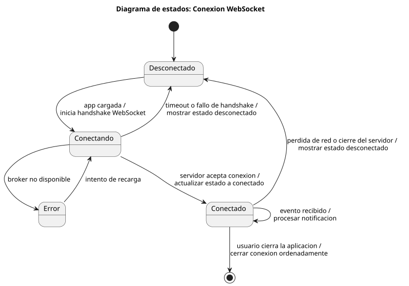

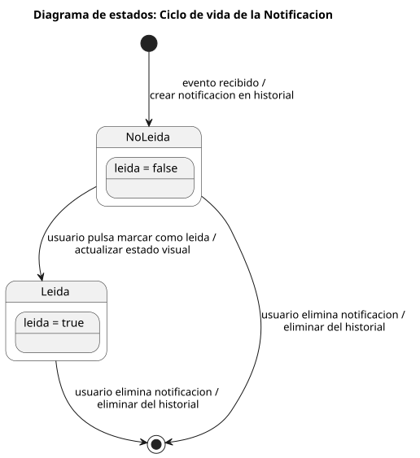

---

### 3.2. Diagrama de objetos

> **De qué hablar:**
> - Instancia concreta del sistema en ejecución: servidor gestiona conexión WS + documento modificado → evento → notificación.
> - Historial con leídas/no leídas. Chat con mensajes asociados a notificaciones.

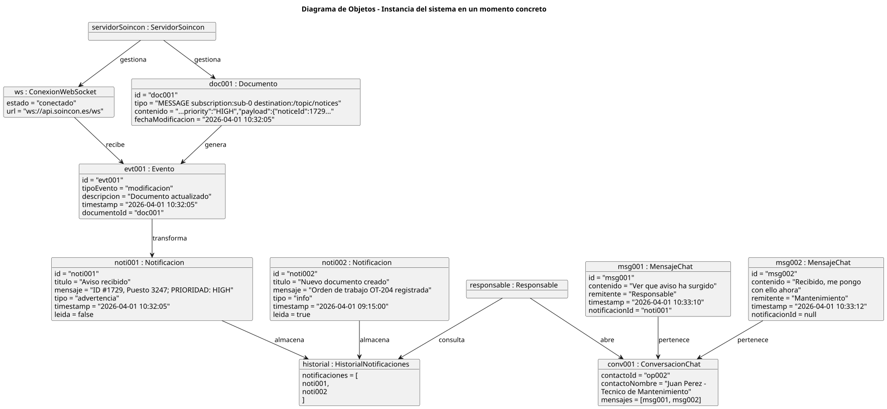

---

## 6. Requisitos — Casos de uso

> **De qué hablar:**
> - 2 actores: **Responsable del centro de control** (humano) y **Tiempo** (actor abstracto, EMI Suite genera eventos automáticamente).
> - Casos de uso principales: ver notificación, eliminar, consultar historial, enviar mensaje de incidencia.

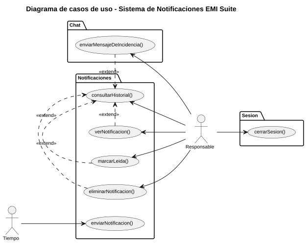

---

### 6.1. Detalle de casos de uso

> **De qué hablar:**
> - Explicar brevemente cada caso con su diagrama de actividad.
> - **Ver notificación**: llega evento → se crea notificación → el responsable la ve.
> - **Eliminar notificación**: el responsable la borra del historial.
> - **Consultar historial**: ver todas las notificaciones de la sesión.
> - **Enviar mensaje de incidencia**: adjuntar una notificación al chat y contactar operario.

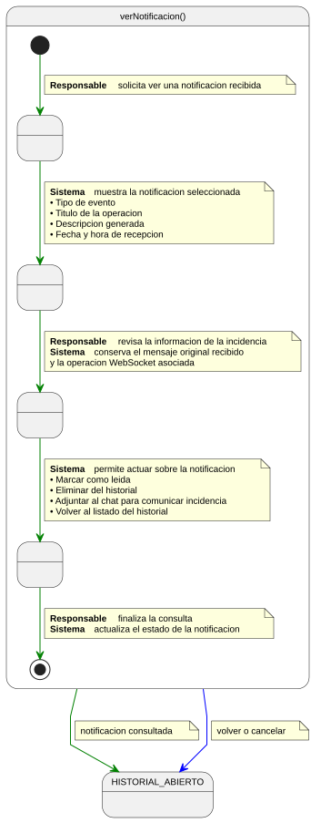

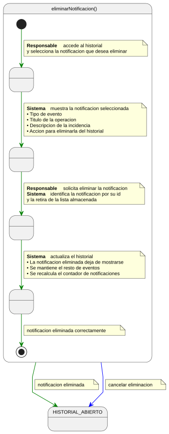

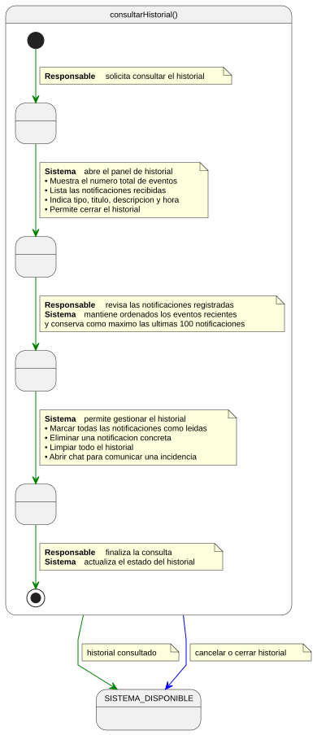

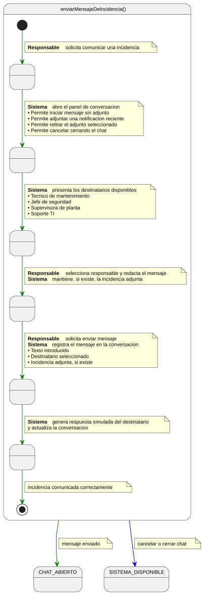

---

## 7. Prototipos de interfaz

> **De qué hablar:**
> - Wireframes de baja fidelidad para validar el diseño antes de programar.
> - 3 vistas principales: Dashboard, Notificación individual, Chat.

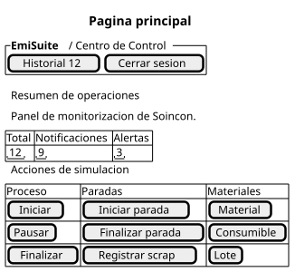

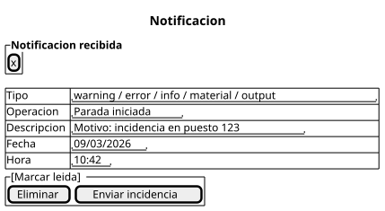

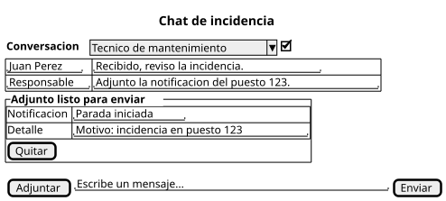

---

## 8. Diagrama de contexto

> **De qué hablar:**
> - Máquina de estados del sistema completo.
> - `SESION_CERRADA` → login → `SISTEMA_DISPONIBLE` → desde ahí: conectar WS, dashboard, historial, chat, tema visual.
> - EMI Suite como entorno externo: modifica documentos → genera eventos → llegan por WebSocket.
> - Cada evento se normaliza → notificación → toast / historial / adjunto de chat.

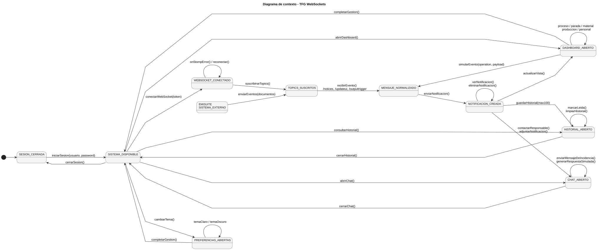

---

## 9. Análisis de la arquitectura

> **De qué hablar:**
> - Cliente-servidor orientado a eventos con **doble canal**: REST (síncrono) + WebSocket (asíncrono).
> - REST para autenticación y consultas puntuales. WS para eventos en tiempo real.
> - Frontend React concentra: presentación, gestión de estado, historial, chat, indicador de conexión.
> - Conexión mediante STOMP sobre WebSocket → suscripción a topics → mensajes estructurados.
> - Decisiones clave: SPA en React para modularidad, STOMP para organizar mensajes por temas, servicios y hooks centralizados.

---

## 10. Análisis de casos de uso (colaboración)

> **De qué hablar:**
> - Diagramas de **colaboración** (comunicación entre objetos del análisis).
> - Mostrar cómo las clases vista, controlador y modelo interactúan en cada caso de uso.

### consultarHistorial()

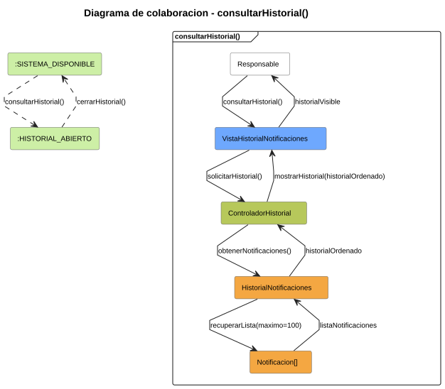

### enviarMensajeDeIncidencia()

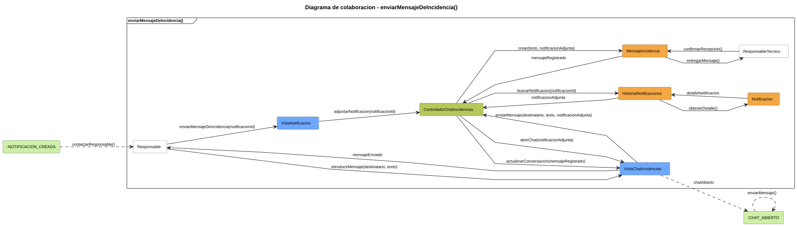

### verNotificacion()

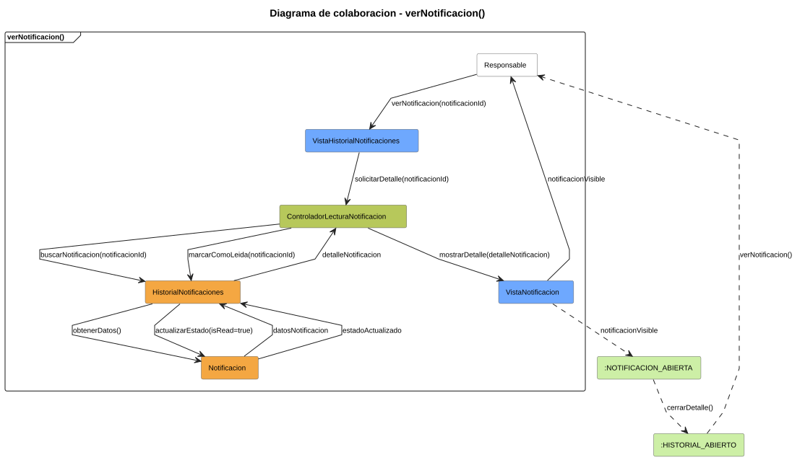

### marcarLeida()

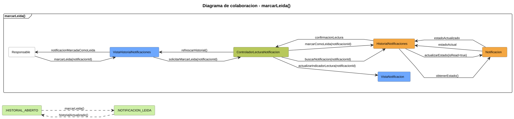

---

## 11. Análisis de clases

> **De qué hablar:**
> - Clases conceptuales, aún no son componentes técnicos.
> - **Modelo**: Documento, Evento, Notificación, HistorialNotificaciones, ConexiónWebSocket.
> - **Vista**: Login, Panel, Historial, Notificación, Chat, Documento, Evento.
> - **Controlador**: Autenticación, RecepciónEventos, Historial, Lectura, Eliminación, Chat, Sincronización.

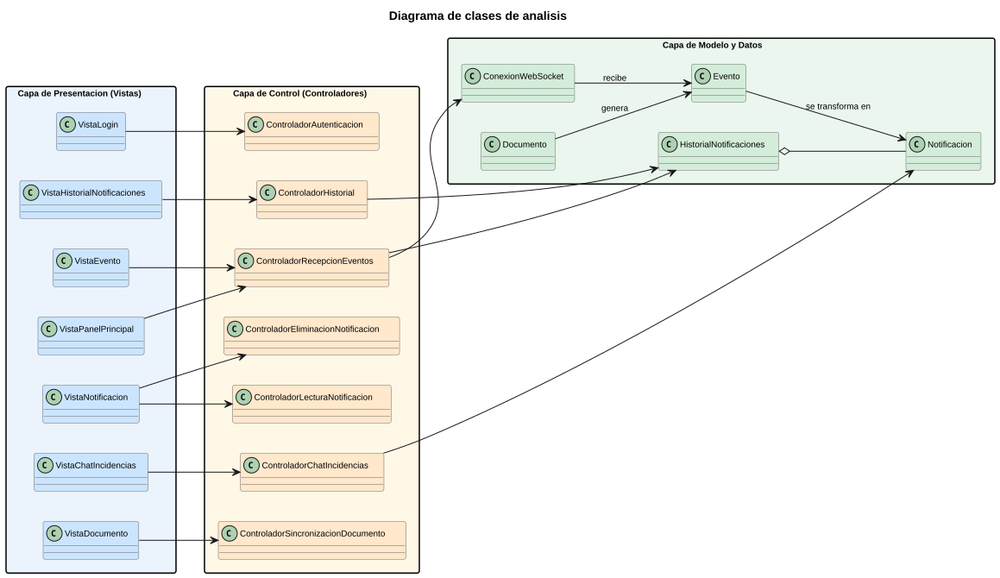

---

## 12. Análisis de paquetes

> **De qué hablar:**
> - Organización del sistema en paquetes funcionales.
> - **Presentación**: vistas y componentes (autenticación, panel, historial, chat).
> - **Control de aplicación**: hooks y contextos (`useWebSocket`, `useAuth`, `ChatContext`, `ThemeContext`).
> - **Servicios**: `auth.service` y `websocket.service` (STOMP/WebSocket).
> - **Configuración**: endpoints, broker, canales.
> - **Modelo y tipos**: `WebSocketMessage`, `NotificationItem`, `ConnectionStatus`, `ChatMessage`.
> - **Sistema externo**: EMI Suite + Broker STOMP.

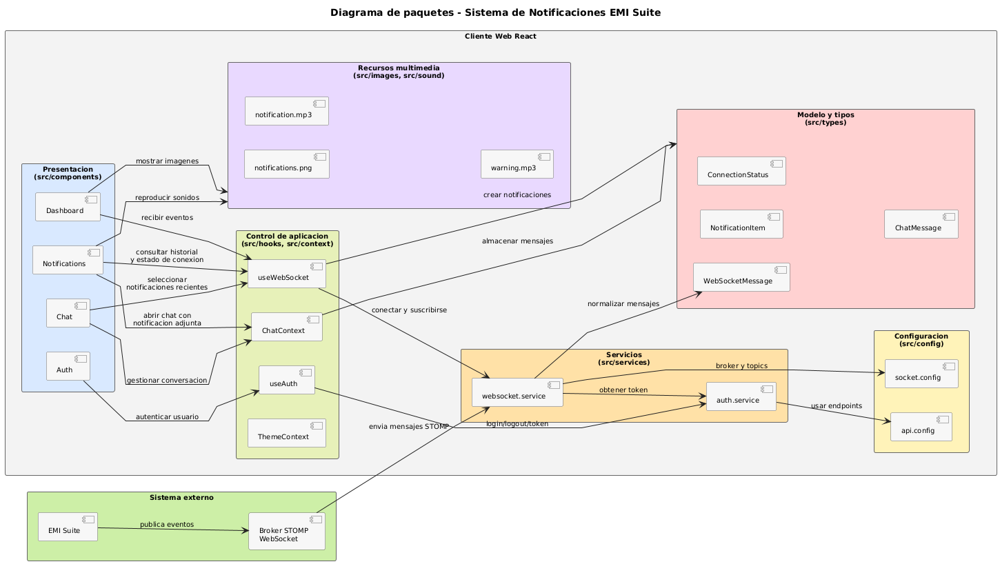

---

## 13. Diseño de la arquitectura

> **De qué hablar:**
> - La arquitectura de análisis se concreta con tecnologías reales.
> - **SPA**: React 19 + TypeScript + Vite.
> - **Tiempo real**: WebSocket nativo + STOMP (`@stomp/stompjs`).
> - **Estado**: hooks personalizados + contextos React + componentes funcionales.
> - **Demo móvil**: Node.js para scripts de arranque en red local.
> - Canal REST reservado para autenticación. Canal WS dedicado a eventos. Navegador como contenedor de estado local.

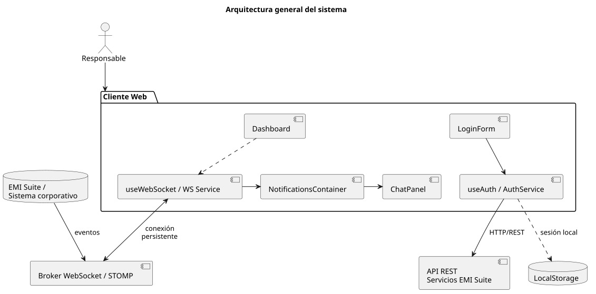

---

## 14. Diseño de casos de uso (secuencia)

> **De qué hablar:**
> - Diagramas de **secuencia**: flujo temporal paso a paso.
> - Ya no son clases conceptuales, son componentes reales del sistema.

### consultarHistorial()

> El responsable abre el historial → la vista pide el listado → se ordena → se muestra.

### enviarMensajeDeIncidencia()

> El responsable adjunta una notificación → abre chat → escribe mensaje → se crea `ChatMessage` → se entrega al destinatario.

### verNotificacion()

> El responsable selecciona notificación → se busca en el historial → se marca como leída → se muestra el detalle.

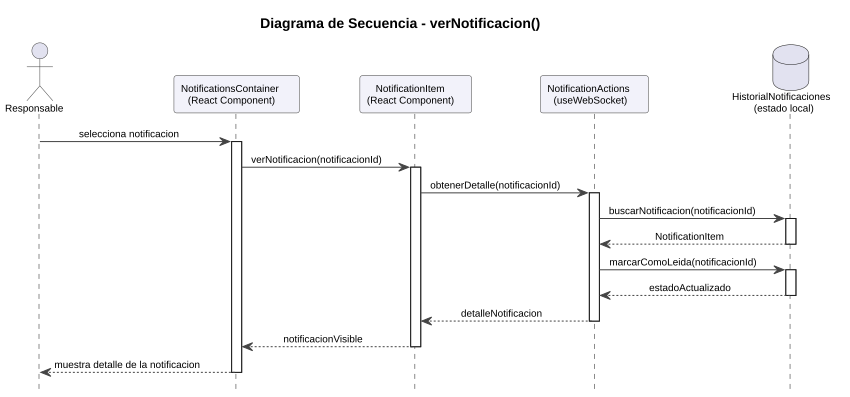

---

## 15. Diagrama de despliegue

> **De qué hablar:**
> - **Equipo del responsable**: navegador ejecuta la SPA + localStorage (token).
> - **Servidor web**: sirve `dist/` (archivos estáticos de Vite: HTML, JS, CSS).
> - **EMI Suite**: servicio de autenticación + Broker STOMP/WebSocket.
> - Topics: `/topic/notices`, `/topic/updateui`, `/topic/outputtrigger`.
> - Comunicaciones: carga inicial (HTTPS) → autenticación (HTTPS) → conexión WSS → recepción de eventos.
> - Reconexión automática cada 5000ms si se pierde la conexión.

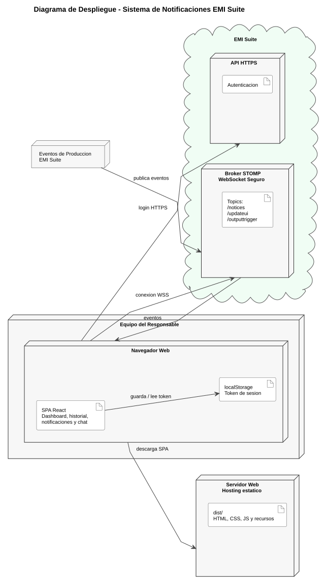

---

<!-- ============================================================ -->
<!-- BLOQUE 3 — DEMO + CONCLUSIONES (~3 min)                      -->
<!-- ============================================================ -->

## 16. Demostración de la solución

> **De qué hablar:**
> - Mostrar capturas de la aplicación real funcionando.
> - Login → Panel principal → Simulación de eventos → Notificaciones toast → Historial → Chat → Cambio de tema.
> - Mencionar que se puede probar desde el móvil en la misma red Wi-Fi.

### Login

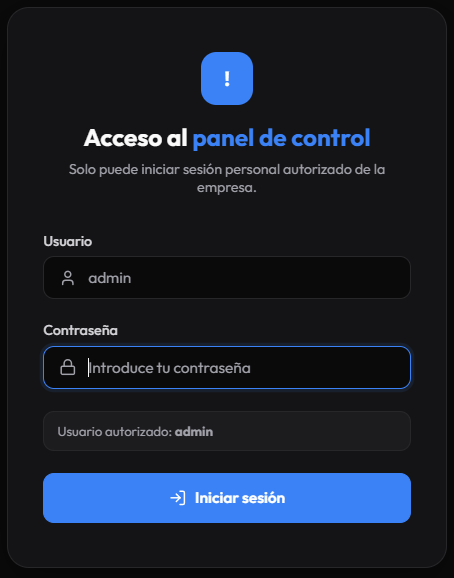

### Panel principal

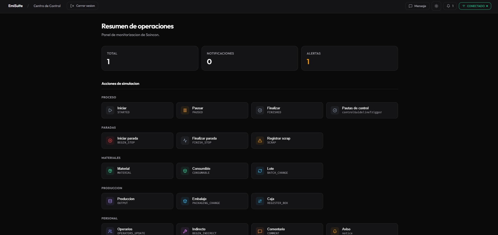

### Notificaciones en acción

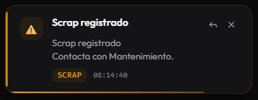 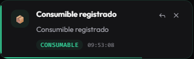

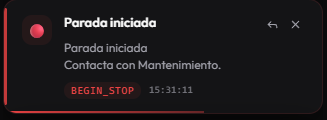 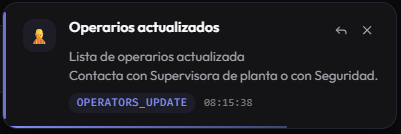

### Historial de notificaciones

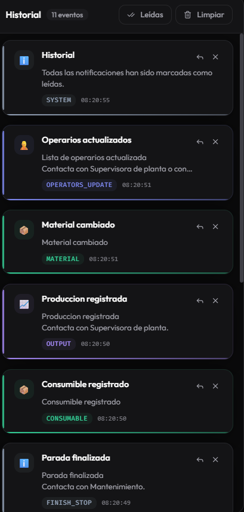

### Chat de incidencias

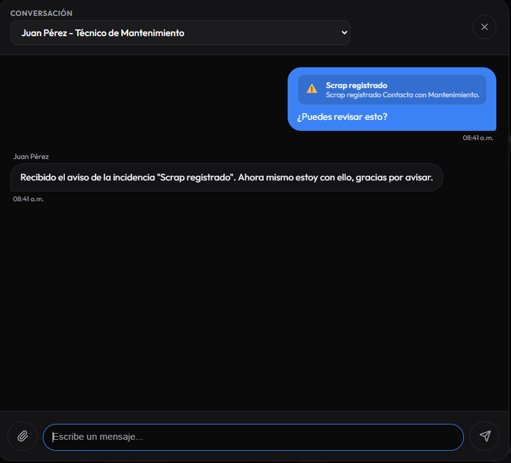

### Cambio de tema visual

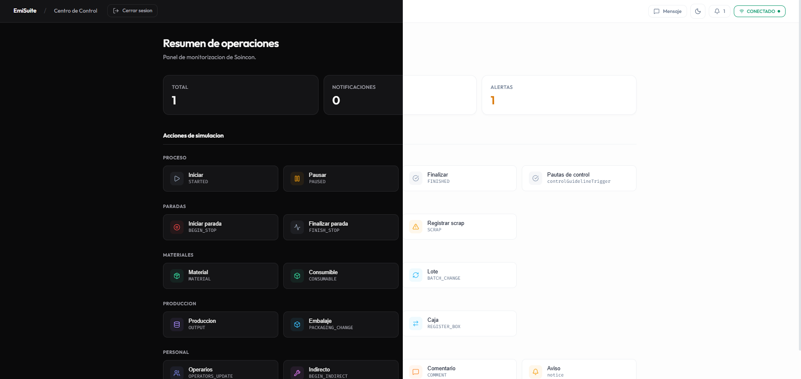

### Estado de conexión WebSocket

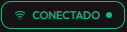 

### Vista móvil

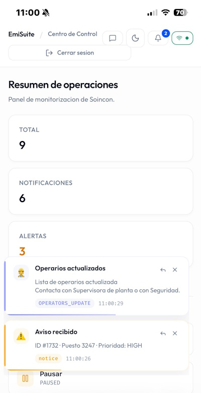

---

## 17. Conclusiones y líneas futuras

> **De qué hablar:**
> - ✅ **Funciona**: recibe eventos al instante y los pinta sin recargar. Va más allá de una prueba de concepto.
> - ✅ **Objetivos cumplidos**: requisitos, análisis y diseño, MVP funcional, documentación reutilizable.
> - ✅ **React encaja perfecto**: cambio de estado → re-render automático. Hooks personalizados mantienen los componentes limpios.
> - ✅ **WebSockets vs Polling**: eliminamos tráfico innecesario, el servidor avisa solo cuando pasa algo.

> **Limitaciones honestas:**
> - Seguridad bajo mínimos (login simulado, no JWT real).
> - Chat en memoria del navegador, sin persistencia en servidor.
> - Es un **prototipo funcional avanzado**, no un producto de producción cerrado.

> **Líneas futuras (por prioridad):**
> 1. 🔴 Conexión real con Soincon (quitar datos simulados).
> 2. 🔴 Experimento formal polling vs WebSocket (latencia, ancho de banda, CPU).
> 3. 🟡 Filtros y alertas inteligentes (agrupación, escalado a supervisores).
> 4. 🟡 Notificaciones push móvil, integración Teams/email, CI/CD.

> **Cierre:**
> - Lo más valioso no es solo el código, sino haber transformado una **necesidad real** de una empresa en un prototipo que funciona, se entiende y marca un camino claro para producción.

---

## ¡Gracias!

### ¿Preguntas?

---

> *Nota: todos los diagramas están disponibles en la carpeta [`imagenes/`](./imagenes/) de este repositorio. El código fuente PlantUML está en [`codigoFuente/`](./codigoFuente/).*

---

<!-- ============================================================ -->
<!-- BLOQUE 1 — INTRODUCCIÓN (~3 min)                             -->
<!-- ============================================================ -->

## 1. Introducción y motivación

> **De qué hablar:**
> - Presentarme: nombre, grado, empresa (Soincon).
> - El TFG nace de una necesidad real durante las prácticas en Soincon.
> - Soincon tiene un producto llamado **EMI Suite 4.0** para la gestión industrial.
> - Problema: los operarios tenían que recargar la página para ver si había novedades → pérdida de tiempo y de información crítica.
> - Objetivo: construir un sistema de notificaciones en **tiempo real** usando **React** y **WebSockets**, eliminando la recarga manual.

---

## 2. Marco teórico — El problema

> **De qué hablar:**
> - Modelo tradicional HTTP: petición-respuesta. El servidor no puede avisarte proactivamente.
> - **Polling**: el cliente pregunta al servidor cada X segundos → tráfico innecesario, latencia.
> - **Long polling**: la conexión se queda abierta esperando → mejor pero sigue siendo ineficiente.
> - **WebSocket**: conexión full-duplex, persistente, bidireccional. Handshake HTTP → upgrade → frames de 2 bytes.
> - Resultado: latencia reducida en un orden de magnitud frente a polling, menos ancho de banda, menos carga de servidor.
> - Stack elegido: **React 19 + TypeScript + Vite + @stomp/stompjs**.

---

## 3. Solución propuesta

> **De qué hablar:**
> - Arquitectura **cliente-servidor con doble canal**: REST (autenticación, consultas) + WebSocket (eventos en tiempo real).
> - 4 módulos principales: Gestor de conexión WS, Integración API Soincon, Componente de notificaciones React, Interfaz visual.
> - Flujo: cliente se conecta → servidor detecta cambio en EMI Suite → emite evento por WebSocket → React actualiza la pantalla automáticamente.
> - Criterios de diseño: reutilización, simplicidad, robustez, observabilidad.

---

## 4. Objetivos

> **De qué hablar:**
> - **Hipótesis**: WebSockets + React es más rápido y eficiente que polling para monitorización industrial.
> - **Objetivo general**: sistema de notificaciones en tiempo real, bidireccional, modular, con buena UX.

| # | Objetivo específico |
|---|---|
| 1 | Disciplina de requisitos: definir necesidades técnicas y funcionales |
| 2 | Análisis y diseño: arquitectura modular (conexión, estado, interfaz) |
| 3 | MVP funcional: recibir, procesar y mostrar notificaciones visualmente |
| 4 | Comparativa rendimiento: tiempo real vs polling (latencia, recursos) |
| 5 | Documentar componente reutilizable para otros proyectos React |

---

<!-- ============================================================ -->
<!-- BLOQUE 2 — DIAGRAMAS A FULL (~14 min)                        -->
<!-- ============================================================ -->

## 5. Modelo del dominio

> **De qué hablar:**
> - El sistema gestiona **Documentos** (de EMI Suite) → generan **Eventos** → se convierten en **Notificaciones**.
> - El Responsable interactúa: ver, marcar leída, borrar.
> - Conexión WebSocket siempre visible (conectado/desconectado/conectando).

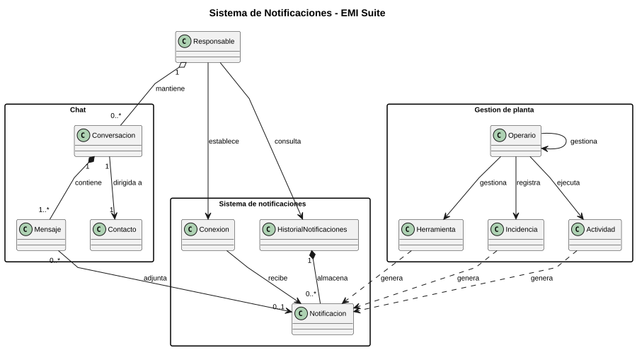

---

### 5.1. Diagramas de estados

> **De qué hablar:**
> - **Conexión WS**: Desconectado → Conectando → Conectado. Si falla el handshake vuelve atrás. Si se pierde red, desconecta.
> - **Notificación**: NoLeída → Leída. Desde cualquier estado se puede eliminar.

---

### 5.2. Diagrama de objetos

> **De qué hablar:**
> - Instancia concreta del sistema en ejecución: servidor gestiona conexión WS + documento modificado → evento → notificación.
> - Historial con leídas/no leídas. Chat con mensajes asociados a notificaciones.

---

## 6. Requisitos — Casos de uso

> **De qué hablar:**
> - 2 actores: **Responsable del centro de control** (humano) y **Tiempo** (actor abstracto, EMI Suite genera eventos automáticamente).
> - Casos de uso principales: ver notificación, eliminar, consultar historial, enviar mensaje de incidencia.

---

### 6.1. Detalle de casos de uso

> **De qué hablar:**
> - Explicar brevemente cada caso con su diagrama de actividad.
> - **Ver notificación**: llega evento → se crea notificación → el responsable la ve.
> - **Eliminar notificación**: el responsable la borra del historial.
> - **Consultar historial**: ver todas las notificaciones de la sesión.
> - **Enviar mensaje de incidencia**: adjuntar una notificación al chat y contactar operario.

---

## 7. Prototipos de interfaz

> **De qué hablar:**
> - Wireframes de baja fidelidad para validar el diseño antes de programar.
> - 3 vistas principales: Dashboard, Notificación individual, Chat.

---

## 8. Diagrama de contexto

> **De qué hablar:**
> - Máquina de estados del sistema completo.
> - `SESION_CERRADA` → login → `SISTEMA_DISPONIBLE` → desde ahí: conectar WS, dashboard, historial, chat, tema visual.
> - EMI Suite como entorno externo: modifica documentos → genera eventos → llegan por WebSocket.
> - Cada evento se normaliza → notificación → toast / historial / adjunto de chat.

---

## 9. Análisis de la arquitectura

> **De qué hablar:**
> - Cliente-servidor orientado a eventos con **doble canal**: REST (síncrono) + WebSocket (asíncrono).
> - REST para autenticación y consultas puntuales. WS para eventos en tiempo real.
> - Frontend React concentra: presentación, gestión de estado, historial, chat, indicador de conexión.
> - Conexión mediante STOMP sobre WebSocket → suscripción a topics → mensajes estructurados.
> - Decisiones clave: SPA en React para modularidad, STOMP para organizar mensajes por temas, servicios y hooks centralizados.

---

## 10. Análisis de casos de uso (colaboración)

> **De qué hablar:**
> - Diagramas de **colaboración** (comunicación entre objetos del análisis).
> - Mostrar cómo las clases vista, controlador y modelo interactúan en cada caso de uso.

### consultarHistorial()

### enviarMensajeDeIncidencia()

### verNotificacion()

### marcarLeida()

---

## 11. Análisis de clases

> **De qué hablar:**
> - Clases conceptuales, aún no son componentes técnicos.
> - **Modelo**: Documento, Evento, Notificación, HistorialNotificaciones, ConexiónWebSocket.
> - **Vista**: Login, Panel, Historial, Notificación, Chat, Documento, Evento.
> - **Controlador**: Autenticación, RecepciónEventos, Historial, Lectura, Eliminación, Chat, Sincronización.

---

## 12. Análisis de paquetes

> **De qué hablar:**
> - Organización del sistema en paquetes funcionales.
> - **Presentación**: vistas y componentes (autenticación, panel, historial, chat).
> - **Control de aplicación**: hooks y contextos (`useWebSocket`, `useAuth`, `ChatContext`, `ThemeContext`).
> - **Servicios**: `auth.service` y `websocket.service` (STOMP/WebSocket).
> - **Configuración**: endpoints, broker, canales.
> - **Modelo y tipos**: `WebSocketMessage`, `NotificationItem`, `ConnectionStatus`, `ChatMessage`.
> - **Sistema externo**: EMI Suite + Broker STOMP.

---

## 13. Diseño de la arquitectura

> **De qué hablar:**
> - La arquitectura de análisis se concreta con tecnologías reales.
> - **SPA**: React 19 + TypeScript + Vite.
> - **Tiempo real**: WebSocket nativo + STOMP (`@stomp/stompjs`).
> - **Estado**: hooks personalizados + contextos React + componentes funcionales.
> - **Demo móvil**: Node.js para scripts de arranque en red local.
> - Canal REST reservado para autenticación. Canal WS dedicado a eventos. Navegador como contenedor de estado local.

---

## 14. Diseño de casos de uso (secuencia)

> **De qué hablar:**
> - Diagramas de **secuencia**: flujo temporal paso a paso.
> - Ya no son clases conceptuales, son componentes reales del sistema.

### consultarHistorial()

> El responsable abre el historial → la vista pide el listado → se ordena → se muestra.

### enviarMensajeDeIncidencia()

> El responsable adjunta una notificación → abre chat → escribe mensaje → se crea `ChatMessage` → se entrega al destinatario.

### verNotificacion()

> El responsable selecciona notificación → se busca en el historial → se marca como leída → se muestra el detalle.

---

## 15. Diagrama de despliegue

> **De qué hablar:**
> - **Equipo del responsable**: navegador ejecuta la SPA + localStorage (token).
> - **Servidor web**: sirve `dist/` (archivos estáticos de Vite: HTML, JS, CSS).
> - **EMI Suite**: servicio de autenticación + Broker STOMP/WebSocket.
> - Topics: `/topic/notices`, `/topic/updateui`, `/topic/outputtrigger`.
> - Comunicaciones: carga inicial (HTTPS) → autenticación (HTTPS) → conexión WSS → recepción de eventos.
> - Reconexión automática cada 5000ms si se pierde la conexión.

---

<!-- ============================================================ -->
<!-- BLOQUE 3 — DEMO + CONCLUSIONES (~3 min)                      -->
<!-- ============================================================ -->

## 16. Demostración de la solución

> **De qué hablar:**
> - Mostrar capturas de la aplicación real funcionando.
> - Login → Panel principal → Simulación de eventos → Notificaciones toast → Historial → Chat → Cambio de tema.
> - Mencionar que se puede probar desde el móvil en la misma red Wi-Fi.

### Login

### Panel principal

### Notificaciones en acción

 

 

### Historial de notificaciones

### Chat de incidencias

### Cambio de tema visual

### Estado de conexión WebSocket

 

### Vista móvil

---

## 17. Conclusiones y líneas futuras

> **De qué hablar:**
> - ✅ **Funciona**: recibe eventos al instante y los pinta sin recargar. Va más allá de una prueba de concepto.
> - ✅ **Objetivos cumplidos**: requisitos, análisis y diseño, MVP funcional, documentación reutilizable.
> - ✅ **React encaja perfecto**: cambio de estado → re-render automático. Hooks personalizados mantienen los componentes limpios.
> - ✅ **WebSockets vs Polling**: eliminamos tráfico innecesario, el servidor avisa solo cuando pasa algo.

> **Limitaciones honestas:**
> - Seguridad bajo mínimos (login simulado, no JWT real).
> - Chat en memoria del navegador, sin persistencia en servidor.
> - Es un **prototipo funcional avanzado**, no un producto de producción cerrado.

> **Líneas futuras (por prioridad):**
> 1. 🔴 Conexión real con Soincon (quitar datos simulados).
> 2. 🔴 Experimento formal polling vs WebSocket (latencia, ancho de banda, CPU).
> 3. 🟡 Filtros y alertas inteligentes (agrupación, escalado a supervisores).
> 4. 🟡 Notificaciones push móvil, integración Teams/email, CI/CD.

> **Cierre:**
> - Lo más valioso no es solo el código, sino haber transformado una **necesidad real** de una empresa en un prototipo que funciona, se entiende y marca un camino claro para producción.

---

## ¡Gracias!

### ¿Preguntas?

---

> *Nota: todos los diagramas están disponibles en la carpeta [`imagenes/`](./imagenes/) de este repositorio. El código fuente PlantUML está en [`codigoFuente/`](./codigoFuente/).*
